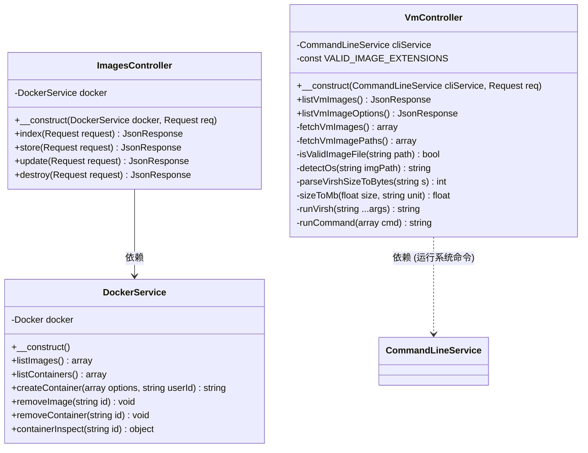
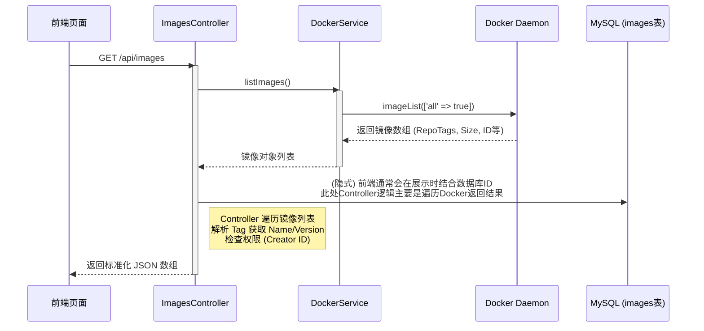
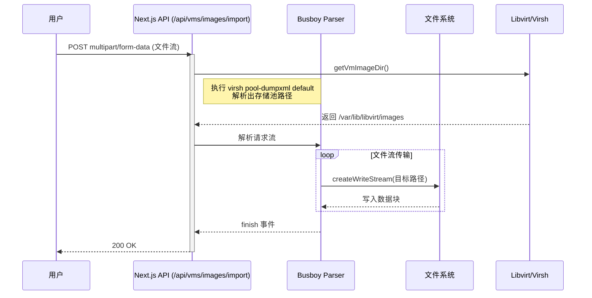
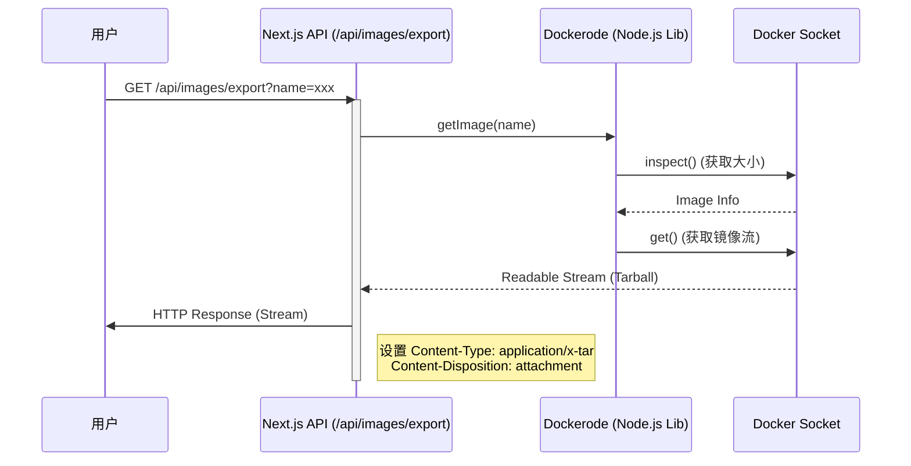

# 软件设计说明书 - 镜像管理模块

## 1. 模块概述
本模块主要负责系统中的两类镜像资源的管理：Docker 容器镜像与虚拟机 (VM) 镜像。模块功能涵盖了镜像的生命周期管理，包括镜像的上传（导入）、下载（导出）、列表查询、元数据编辑、删除以及启动实例化等操作。该模块采用混合架构设计，由 Next.js 前端层负责大文件的流式传输，Laravel 后端层负责业务逻辑控制、元数据管理及底层虚拟化引擎（Docker Engine/Libvirt）的交互。

## 2. 功能描述

### 2.1 Docker 镜像管理
| 功能点 | 描述 |
| :--- | :--- |
| **镜像列表查询** | 展示系统中现有的 Docker 镜像，包括名称、版本、大小、上传时间等信息。支持基于用户角色的权限过滤（管理员可见所有，普通用户仅见自己上传的）。 |
| **镜像导入** | 支持用户上传 `.tar` 格式的 Docker 镜像文件，系统自动将其加载到 Docker 引擎中。 |
| **镜像导出** | 允许用户将系统中的 Docker 镜像打包为 `.tar` 文件并下载到本地。 |
| **镜像编辑** | 支持修改镜像的元数据，如描述信息等（通过数据库记录）。 |
| **镜像删除** | 从 Docker 引擎中移除指定镜像，并同步删除数据库中的关联记录。 |
| **启动容器** | 基于选定的镜像快速创建一个新的 Docker 容器实例。 |

### 2.2 虚拟机 (VM) 镜像管理
| 功能点 | 描述 |
| :--- | :--- |
| **镜像列表查询** | 扫描底层存储池（Libvirt Pool），列出所有可用的 VM 镜像文件。自动结合 `vmImageOverrides.json` 中的元数据（如操作系统类型、描述）进行展示。 |
| **镜像导入** | 支持上传虚拟机磁盘镜像文件（如 `.qcow2`, `.iso` 等），直接写入底层存储目录。 |
| **镜像导出** | 允许用户下载虚拟机镜像文件。 |
| **元数据覆盖** | 由于 VM 镜像本质是文件，系统提供额外的元数据管理功能，允许用户为特定文件名的镜像指定操作系统类型和描述，并持久化存储。 |
| **镜像删除** | 删除底层文件系统中的镜像文件。 |
| **启动虚拟机** | 基于选定的镜像模板创建新的虚拟机实例（通常涉及克隆或作为基础镜像）。 |

---

## 3. 数据结构

本模块主要涉及 MySQL 数据库中的 `images` 表，用于存储 Docker 镜像的持久化元数据。VM 镜像主要依赖文件系统和 JSON 配置文件，不涉及核心数据库表结构。

### 3.1 数据库表：images (Docker 镜像元数据)

| 字段名 | 类型 | 约束 | 说明 |
| :--- | :--- | :--- | :--- |
| `id` | VARCHAR(255) | PRIMARY KEY | 镜像记录的唯一标识符 (UUID) |
| `name` | VARCHAR(255) | NOT NULL | 镜像仓库名称 (Repository Name) |
| `type` | VARCHAR(255) | NOT NULL | 镜像类型标识 (固定为 'docker') |
| `version` | VARCHAR(255) | NOT NULL | 镜像标签/版本 (Tag, 如 'latest') |
| `description` | TEXT | NULLABLE | 用户对镜像的自定义描述 |
| `file_name` | VARCHAR(255) | NULLABLE | 原始上传文件名 (保留字段) |
| `size` | VARCHAR(255) | NULLABLE | 镜像大小的文本描述 (如 '100MB') |
| `upload_date` | TIMESTAMP | NOT NULL | 记录创建/上传时间 |

---

## 4. 类设计

本模块的核心逻辑主要集中在后端的 Controller 层和 Service 层。

### 4.1 类图概览

### 4.2 核心类说明

#### 1. `App\Http\Controllers\Docker\ImagesController`
负责 Docker 镜像的元数据管理接口。
*   **index()**: 获取镜像列表。它不仅从 `DockerService` 获取底层镜像列表，还结合数据库中的 `images` 表（通过 `Image` Model）来补充描述信息，并根据用户角色（admin/student）过滤可见性。
*   **store()**: 仅在数据库创建一条记录（实际的文件上传由前端直传 Docker 引擎，此处用于前端上传成功后登记元数据）。
*   **destroy()**: 调用 `DockerService` 删除底层镜像，同时删除数据库记录。

#### 2. `App\Services\DockerService`
封装了 `docker-php` 库的操作，直接与 Docker Daemon 通信。
*   **__construct()**: 初始化 Docker Client，自动检测 Windows (TCP) 或 Linux (Unix Socket) 环境。
*   **listImages()**: 调用 `docker->imageList()` 获取所有镜像详情。
*   **removeImage()**: 调用 `docker->imageDelete()` 强制删除镜像。

#### 3. `App\Http\Controllers\Vm\VmController`
负责虚拟机镜像的管理，通过 `virsh` 命令行工具与 KVM/Libvirt 交互。
*   **listVmImages()**: 核心方法。
    1.  调用 `fetchVmImages()`：通过 `virsh pool-dumpxml` 获取存储池路径。
    2.  优先使用 `FilesystemIterator` 扫描存储池目录，列出符合扩展名（qcow2, iso等）的文件。
    3.  若目录不可读，降级使用 `virsh vol-list` 解析输出。
    4.  返回包含文件名、大小、路径的列表。
*   **fetchVmImagePaths()**: 获取简化的镜像路径列表，用于下拉菜单选项。
*   **isValidImageFile()**: 校验文件扩展名是否在允许列表中。

---

## 5. 关键流程设计

### 5.1 Docker 镜像列表获取 (典型查询场景)

该流程展示了如何从 Docker 引擎获取实时数据，并与数据库中的元数据合并。

### 5.2 虚拟机镜像上传 (流式处理场景)

VM 镜像通常体积巨大，不适合经过 PHP 后端。系统采用 Next.js API Route 直接对接文件流。

### 5.3 Docker 镜像导出 (下载场景)

类似上传，下载也通过 Next.js 直接对接 Docker Socket 进行流式转发。

---

## 6. 接口实现要点

### 6.1 Docker 镜像接口

| 路径 | 方法 | 功能 | 备注 |
| :--- | :--- | :--- | :--- |
| `/back/api/images` | GET | 获取镜像列表 | 结合了 Docker 引擎状态和数据库权限过滤 |
| `/back/api/images` | POST | 登记镜像元数据 | 文件上传成功后调用，写入 `images` 表 |
| `/back/api/images` | PUT | 更新镜像信息 | 修改描述等字段 |
| `/back/api/images` | DELETE | 删除镜像 | 级联删除 Docker 镜像和数据库记录 |
| `/api/images/import` | POST | 导入镜像文件 | Next.js 路由，直连 Docker Socket `loadImage` |
| `/api/images/export` | GET | 导出镜像文件 | Next.js 路由，直连 Docker Socket `get` |

### 6.2 虚拟机 (VM) 镜像接口

| 路径 | 方法 | 功能 | 备注 |
| :--- | :--- | :--- | :--- |
| `/back/api/vms/images` | GET | 获取 VM 镜像列表 | 扫描 Libvirt 存储池目录 |
| `/back/api/vms/image-options` | GET | 获取镜像路径选项 | 简化的列表，用于下拉选择 |
| `/api/vms/images/import` | POST | 上传 VM 镜像 | Next.js 路由，流式写入存储池目录 |
| `/api/vms/images/export` | GET | 下载 VM 镜像 | Next.js 路由，流式读取文件 |
| `/api/vm-image-overrides` | GET | 获取镜像元数据覆盖 | 读取 `data/vmImageOverrides.json` |
| `/api/vm-image-overrides` | POST | 保存镜像元数据覆盖 | 写入 `data/vmImageOverrides.json` |
