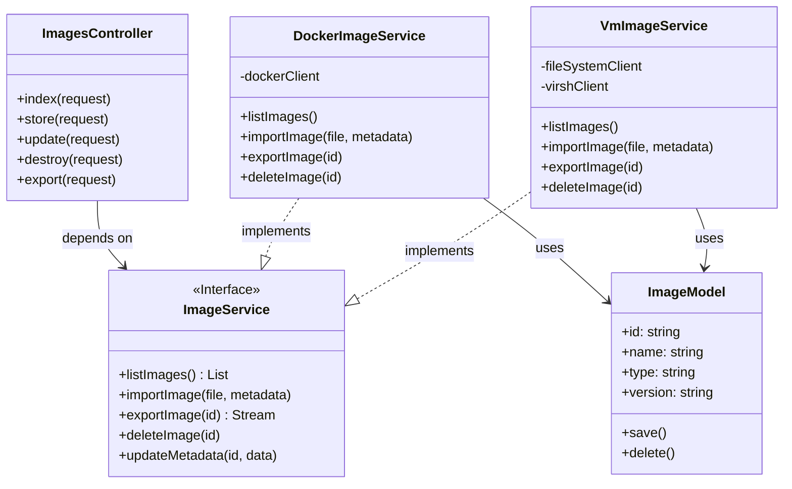
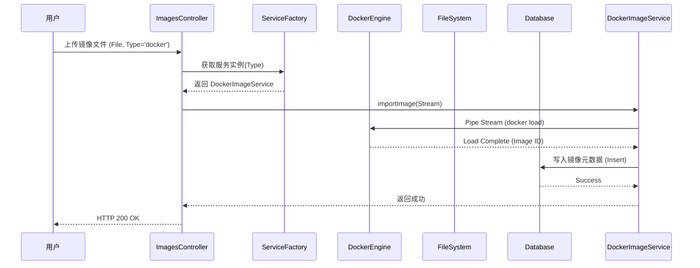
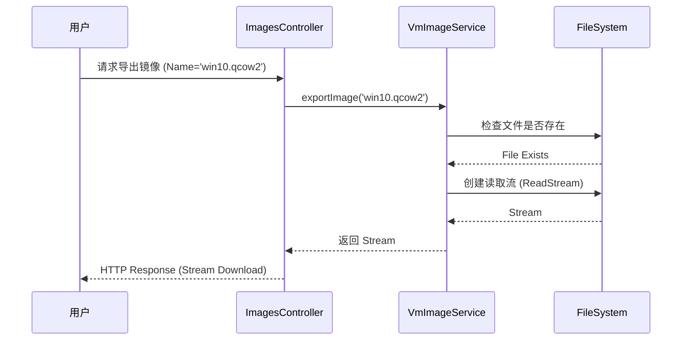

# 镜像管理模块软件设计说明书

## 1. 功能描述

镜像管理模块是本系统的核心组件之一，负责统一管理系统中所有的镜像资源。该模块旨在为上层应用（如环境构建、靶场部署等）提供稳定、高效的镜像服务。考虑到系统支持多种虚拟化技术（容器技术与虚拟机技术），本模块设计了一个统一的抽象层，将Docker容器镜像与KVM/QEMU虚拟机镜像纳入同一管理框架下，屏蔽了底层异构技术的差异性。

本模块主要包含以下功能点：

1.  **统一镜像视图管理**：
    提供一个整合的视图，展示系统中所有可用的镜像资源。用户可以查看镜像的详细信息，包括镜像名称、版本号、类型（Docker容器或虚拟机）、文件大小、上传时间以及描述信息等。系统支持按镜像类型、名称等关键字进行检索和过滤，方便用户快速定位所需资源。

2.  **镜像导入（上传）**：
    支持用户将本地的镜像文件导入到系统中。
    *   对于 **Docker 镜像**，支持导入 `.tar` 格式的镜像包，系统接收文件后会自动调用 Docker 引擎的加载指令（`docker load`）将其注册到本地镜像仓库中。
    *   对于 **虚拟机镜像**，支持导入常见的磁盘镜像格式（如 `.qcow2`, `.img`, `.iso` 等）。系统会将文件安全地传输至服务器指定的存储池目录中，并进行必要的文件校验。
    导入成功后，系统会自动提取镜像元数据并存入数据库，确保数据的一致性。

3.  **镜像导出（下载）**：
    支持用户将系统中的镜像导出为文件下载到本地。
    *   对于 **Docker 镜像**，系统调用 Docker 引擎的保存指令（`docker save`），将镜像打包为 `.tar` 流并传输给用户。
    *   对于 **虚拟机镜像**，系统直接读取存储池中的镜像文件，以流式传输的方式提供下载服务。

4.  **镜像生命周期管理**：
    提供镜像的删除功能。当用户发起删除请求时，系统不仅会删除数据库中的元数据记录，还会根据镜像类型清理底层的存储资源（如移除 Docker 镜像或删除存储池中的磁盘文件），确保资源得到完全释放。

5.  **元数据维护**：
    支持对镜像的非技术属性进行编辑，如修改镜像的描述信息、标记版本号等。这有助于管理员对镜像资源进行分类和业务标记。

---

## 2. 数据结构

为了支持上述功能，并在数据库层面统一管理不同类型的镜像，本模块设计了 `images` 表。该表作为镜像元数据的核心存储，记录了镜像的通用属性。

### 2.1 镜像元数据表 (images)

| 字段名 (Field) | 类型 (Type) | 约束 (Constraint) | 说明 (Description) |
| :--- | :--- | :--- | :--- |
| `id` | VARCHAR(255) | PRIMARY KEY | 镜像唯一标识符（UUID），用于关联底层资源 |
| `name` | VARCHAR(255) | NOT NULL | 镜像名称（如 `ubuntu`, `win10`） |
| `type` | VARCHAR(50) | NOT NULL | 镜像类型，枚举值：`docker` 或 `vm` |
| `version` | VARCHAR(50) | NOT NULL | 镜像版本号（如 `latest`, `20.04`, `v1`） |
| `description` | TEXT | NULLABLE | 镜像的详细描述或备注信息 |
| `file_name` | VARCHAR(255) | NULLABLE | 对应的物理文件名（主要用于虚拟机镜像） |
| `size` | VARCHAR(50) | NULLABLE | 镜像大小的文本表示（如 `500 MB`） |
| `upload_date` | TIMESTAMP | NOT NULL | 镜像上传或注册的时间 |

---

## 3. 类设计

本模块采用面向接口的设计思想，定义了统一的 `ImageService` 接口，屏蔽了底层 Docker 与 Libvirt (KVM) 的操作差异。`ImagesController` 作为控制层，根据请求参数调用对应的服务实现类。

### 3.1 类图设计

以下类图展示了模块的核心类结构及其关系：

### 3.2 关键类说明

1.  **ImagesController**:
    Web API 的入口，负责接收 HTTP 请求，进行参数校验（如检查文件格式、权限验证），并根据 `type` 参数（docker 或 vm）实例化或调用相应的 Service 进行业务处理。

2.  **ImageService (Interface)**:
    定义了镜像管理的核心业务行为规范。任何新增的镜像类型只需实现该接口即可接入系统，体现了良好的扩展性。

3.  **DockerImageService**:
    实现了针对 Docker 容器镜像的具体操作。它通过 `Docker Client` 与本地 Docker 守护进程通信，执行 `docker images`, `docker load`, `docker save` 等指令，并同步更新数据库。

4.  **VmImageService**:
    实现了针对虚拟机镜像的具体操作。它主要与文件系统和 `Libvirt` 工具集交互，负责管理存储池目录下的镜像文件，并通过 `qemu-img` 或 `virsh` 获取镜像的物理信息。

---

## 4. 关键流程设计

### 4.1 镜像导入（上传）流程

镜像导入是本模块最复杂的业务场景之一，涉及大文件传输、底层引擎交互以及数据库事务。

**典型业务场景**：用户在前端选择一个 `.tar` 格式的 Docker 镜像包或 `.qcow2` 格式的虚拟机磁盘文件，点击“上传”按钮。

**处理流程**：
1.  **请求接收**：Gateway 接收多部分表单数据（Multipart/Form-Data），包含文件流和元数据（名称、类型等）。
2.  **类型分发**：Controller 根据 `type` 字段判断处理策略。
3.  **Docker 处理分支**：
    *   将文件流直接管道传输（Pipe）给 Docker Engine 的 API (`/images/load`)。
    *   Docker Engine 解析并加载镜像。
    *   Service 解析镜像的 RepoTags 提取名称和版本。
4.  **VM 处理分支**：
    *   确定虚拟机镜像存储目录（如 `/home/ubuntu/web/virsh/images`）。
    *   创建写入流，将上传的文件流写入目标磁盘路径。
    *   写入完成后，调用 `qemu-img info` (可选) 验证文件完整性及获取大小。
5.  **元数据持久化**：将镜像的 ID、名称、大小、上传时间等信息写入 `images` 数据库表。
6.  **响应**：向前端返回上传成功的状态和新镜像的 ID。

### 4.2 镜像导出（下载）流程

**典型业务场景**：用户在镜像列表中点击“导出”按钮，浏览器开始下载镜像文件。

**处理流程**：
1.  **请求接收**：Controller 接收包含镜像 ID 或名称的 GET 请求。
2.  **资源定位**：
    *   **Docker**：调用 Docker Engine API (`/images/{name}/get`) 获取镜像的 tar 流。
    *   **VM**：在存储目录中定位对应的物理文件，创建文件读取流。
3.  **流式传输**：将获取到的 Stream 封装为 Web Response 流。
4.  **设置响应头**：设置 `Content-Type` (application/x-tar 或 application/octet-stream) 和 `Content-Disposition` (attachment)，触发浏览器下载。

---

## 5. 接口实现要点

本模块对外提供一套 RESTful 风格的 API 接口，路径设计遵循资源导向原则。

| 路径 (Path) | 方法 (Method) | 功能 (Function) | 备注 (Remarks) |
| :--- | :--- | :--- | :--- |
| `/api/images` | `GET` | 获取镜像列表 | 支持查询参数 `?type=docker|vm` 和 `?role=admin|student` 进行过滤。返回统一格式的 JSON 列表。 |
| `/api/images` | `POST` | 创建/上传镜像 | `Multipart/Form-Data` 格式。需包含 `file` (文件流), `type` (类型), `name` (名称) 等字段。 |
| `/api/images` | `PUT` | 更新镜像信息 | 用于修改镜像的 `description` 等非结构化元数据。 |
| `/api/images` | `DELETE` | 删除镜像 | 通过查询参数 `?id={uuid}` 指定要删除的镜像。同时删除数据库记录和底层资源。 |
| `/api/images/export` | `GET` | 导出镜像 | 通过查询参数 `?name={name}` 指定镜像。返回二进制文件流，触发下载。 |

### 5.1 实现注意事项

1.  **大文件处理**：在导入和导出接口的实现中，必须使用**流式处理 (Streaming)**，严禁将整个镜像文件读入内存，以防止内存溢出 (OOM)。Node.js 端应使用 `pipe` 或 `ReadableStream`，PHP 端应使用 `fopen` 和 `php://output`。
2.  **超时设置**：镜像上传和下载通常耗时较长，需调整 Web 服务器（如 Nginx）和应用服务器（PHP-FPM/Node.js）的超时时间限制。
3.  **权限控制**：普通用户只能查看公共镜像或自己上传的镜像，管理员拥有所有镜像的管理权限。接口层需集成权限中间件进行校验。
4.  **原子性**：在删除操作中，应先确认底层资源删除成功，再删除数据库记录，或者使用事务和补偿机制确保数据一致性。
