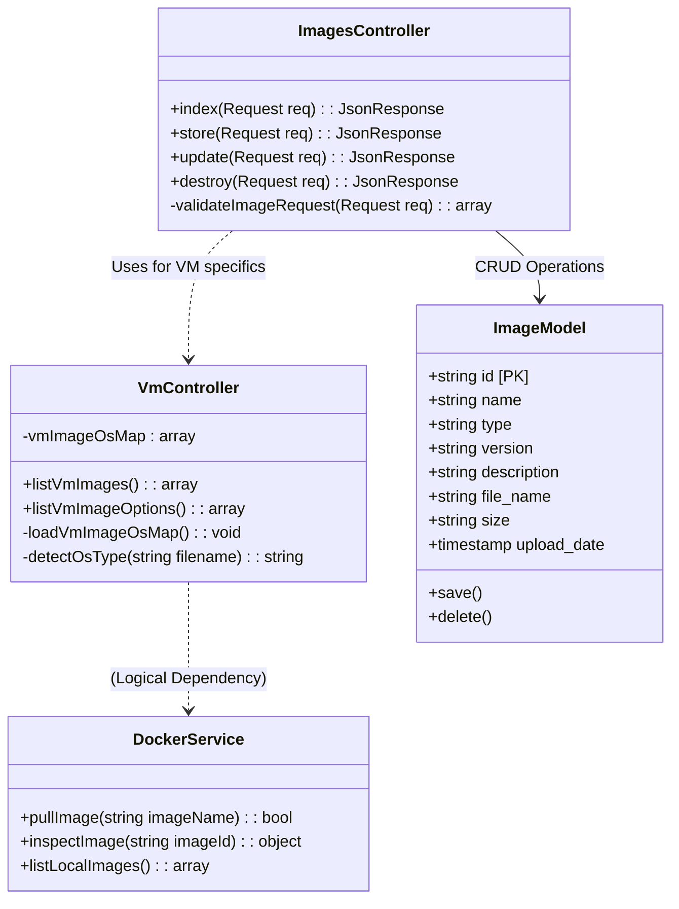
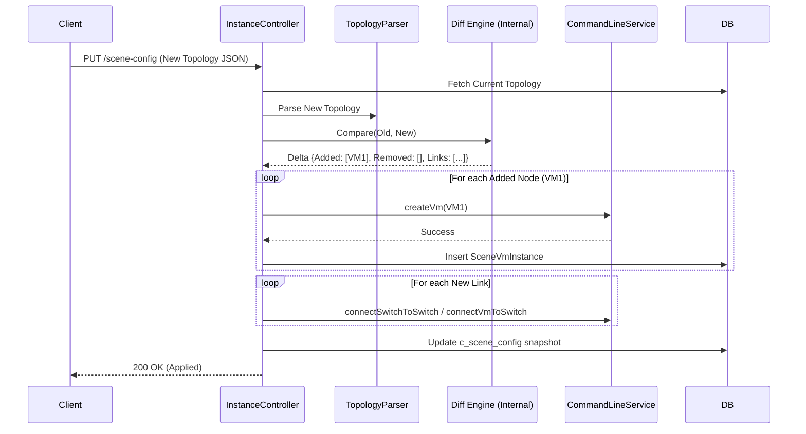
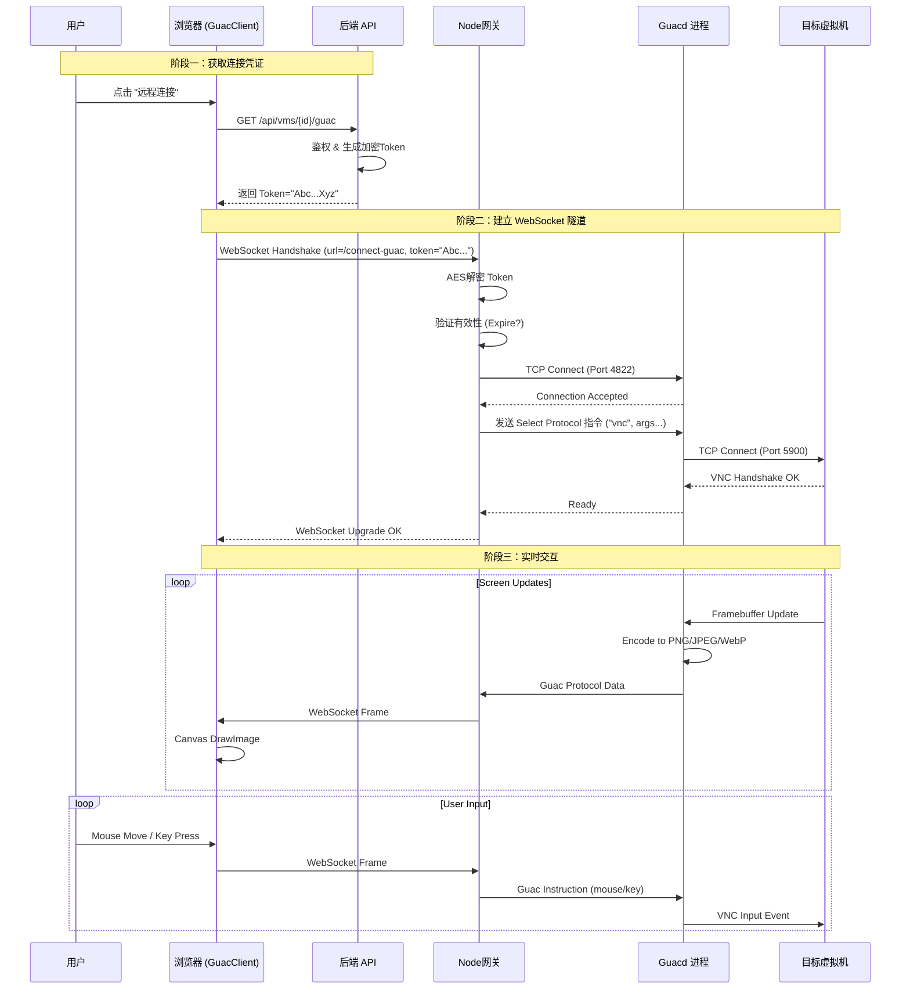

# 软件设计说明书

## 4.2 基础支撑分系统设计

基础支撑分系统作为网络靶场平台的基石，承担着计算资源虚拟化、网络环境构建、存储资源管理以及跨节点调度等核心职责。其设计遵循高内聚、低耦合原则，通过标准化的接口向下屏蔽异构基础设施（KVM, Docker, OVS）的差异，向上为课程学习、攻防演练、漏洞复现等业务应用提供稳定、可控、弹性的实验环境。

本章节将深入剖析该分系统的四大核心模块，从设计理念、类架构、数据库模型到接口规范进行详尽阐述。

### 4.2.3 镜像管理模块 (Image Management Module)

#### 4.2.3.1 模块概述与设计目标

镜像管理模块是靶场环境构建的源头。在混合虚拟化架构下，系统需要同时纳管轻量级的容器镜像（Container Images）和重量级的虚拟机镜像（Virtual Machine Images）。该模块的设计不仅仅是简单的文件存储，更涉及到镜像的版本控制、元数据索引、完整性校验以及在多节点集群中的分发策略。

**核心设计目标：**

1.  **统一元数据管理 (Unified Metadata Management)**：尽管底层存储介质不同（Docker Registry vs 分布式文件系统），但在应用层必须提供一致的镜像对象模型。管理员无需关心底层的存储细节，只需通过统一的 ID 对镜像进行检索和操作。
2.  **自动化发现与注册 (Automated Discovery)**：支持从物理存储层自动扫描未注册的镜像文件（如上传至服务器的 `.qcow2` 文件），简化管理员的录入工作。
3.  **多版本并行支持 (Multi-versioning)**：系统必须支持同一镜像的多个版本并存（例如 `Ubuntu 20.04 v1.0` 用于基础教学，`Ubuntu 20.04 v2.0` 集成了特定漏洞用于攻防赛），并允许业务场景指定特定版本。
4.  **高扩展性设计 (Extensibility)**：数据库字段设计需预留足够的扩展空间，以支持未来可能引入的镜像标签（Tags）、操作系统图标（Icon）、最小硬件配置要求（Min CPU/RAM）等属性。

#### 4.2.3.2 详细类设计 (Class Structure)

本模块采用典型的 MVC 架构，逻辑分层清晰：

1.  **`ImagesController` (控制器层)**
    *   **定位**：处理来自前端的 HTTP 请求，执行参数验证，并调用 Service 层或 Model 层完成业务逻辑。
    *   **核心职责**：
        *   **镜像列表检索 (`index`)**：支持按类型（vm/docker）、名称关键字进行模糊搜索，支持分页返回结果。
        *   **镜像注册 (`store`)**：接收用户提交的元数据，创建数据库记录。
        *   **镜像更新 (`update`)**：修改镜像的描述、版本号等非关键属性。
        *   **镜像销毁 (`destroy`)**：级联删除数据库记录。注意：为了数据安全，默认不删除物理文件，除非通过特定参数强制指定。

2.  **`VmController` (特定业务逻辑层)**
    *   **定位**：处理与 KVM 虚拟化紧密相关的特定逻辑。
    *   **核心职责**：
        *   **物理文件扫描 (`listVmImages`)**：遍历宿主机配置的镜像存储目录（如 `/var/lib/libvirt/images`），识别 `.qcow2`, `.img` 等格式文件，并排除临时快照文件。
        *   **OS 类型推断**：结合 `vmImageOverrides.json` 配置文件，根据文件名特征推断虚拟机的操作系统类型（如 `win7`, `ubuntu`, `centos`），这对后续生成正确的 `virt-install` 启动命令至关重要。

3.  **`DockerService` (服务层)**
    *   **定位**：封装 Docker Engine API 的底层交互。
    *   **核心职责**：
        *   **镜像拉取 (`pullImage`)**：调用 Docker CLI 或 API 从远程仓库（Docker Hub / Private Registry）拉取镜像。
        *   **元数据检查 (`inspectImage`)**：获取容器镜像的详细配置（Entrypoint, Env, ExposedPorts），用于自动填充数据库中的配置建议字段。

**UML 类图 (Class Diagram):**



#### 4.2.3.3 数据库详细设计 (Database Detailed Design)

为了满足灵活性和扩展性，`images` 表的设计不仅包含了基础属性，还对字段的长度和类型进行了深思熟虑的定义。

**表名**: `images`
**存储引擎**: InnoDB (支持事务)
**字符集**: utf8mb4 (支持全 Unicode 字符，包括 Emoji)

| 字段名 (Field) | 数据类型 (Type) | 长度/精度 | 允许空 (Null) | 默认值 (Default) | 业务含义与设计详细说明 (Detailed Description) |
| :--- | :--- | :--- | :--- | :--- | :--- |
| `id` | VARCHAR | 64 | NO | - | **主键 (Primary Key)**。使用 UUID (通用唯一识别码) 格式，而非自增 ID。这是为了在多节点数据同步或合并时避免主键冲突，同时也增加了被遍历攻击的难度。 |
| `name` | VARCHAR | 255 | NO | - | **镜像显示名称**。例如 "Windows 7 SP1 纯净版"。用于在前端界面展示，应简洁明了。 |
| `type` | VARCHAR | 50 | NO | 'vm' | **镜像类型枚举**。当前支持：<br>1. `vm` (KVM 虚拟机镜像)<br>2. `docker` (容器镜像)<br>此字段决定了后续实例化时的处理逻辑。未来可扩展支持 `pod` 或 `lxc`。 |
| `version` | VARCHAR | 50 | NO | '1.0' | **语义化版本号**。如 "1.0.0", "beta-2"。用于区分同一基础环境的不同迭代。在业务逻辑中，`name` + `version` 应当是唯一的组合。 |
| `description` | TEXT | - | YES | NULL | **详细描述**。支持 Markdown 格式。用于记录镜像的用途、预装软件列表、默认账号密码（如 root/toor）、已知漏洞列表等重要信息。字段类型为 TEXT，最大支持 64KB 内容。 |
| `file_name` | VARCHAR | 255 | YES | NULL | **物理资源标识符**。<br>- 对于 **VM**：存储实际的文件名（如 `win7_ent.qcow2`）。系统根据此文件名在存储池中定位文件。<br>- 对于 **Docker**：存储镜像的 Repository Tag（如 `kalilinux/kali-rolling:latest`）。 |
| `size` | VARCHAR | 50 | YES | NULL | **资源大小**。存储字符串形式的大小（如 "15.4 GB"）。主要用于前端展示，帮助用户预估下载或部署时间。该字段是非结构化的，仅作参考。 |
| `upload_date` | TIMESTAMP | - | NO | CURRENT | **创建/注册时间**。记录该镜像首次被纳入系统管理的时间。用于审计和按时间排序。 |
| `c_min_cpu` | INT | - | YES | 1 | **(扩展字段) 最小 CPU 核心数**。建议分配的最小 vCPU 数量，防止因资源不足导致启动失败。 |
| `c_min_ram` | INT | - | YES | 1024 | **(扩展字段) 最小内存 (MB)**。建议分配的最小内存大小。 |

**数据库设计说明 (Design Notes)**:
1.  **索引策略**: 应当在 `type` 字段建立索引，以加速按类型筛选的查询速度。在 `name` 字段建立全文索引或普通索引，支持模糊搜索。
2.  **数据完整性**: 虽然应用层保证了 `name` + `version` 的唯一性，但在数据库层建议添加 `UNIQUE KEY (name, version)` 约束，以提供兜底的数据一致性保障。

#### 4.2.3.4 接口设计详细规约 (API Specification)

本模块对外提供一套遵循 RESTful 风格的 HTTP 接口。所有响应均封装在统一的 JSON 结构中。

**1. 注册新镜像 (Create Image)**

*   **URL**: `POST /api/images`
*   **Method**: `POST`
*   **Content-Type**: `application/json`
*   **权限要求**: Admin (系统管理员)
*   **业务逻辑**:
    1.  校验必填字段 (`name`, `type`, `version`, `file_name`)。
    2.  如果 `type` 为 `vm`，系统会检查后端存储目录中是否存在对应的 `file_name` 文件。如果不存在，将返回警告或错误。
    3.  生成 UUID 作为主键。
    4.  写入数据库。
*   **Request Body (Example)**:
    ```json
    {
        "name": "Kali Linux Penetration",
        "type": "docker",
        "version": "2024.1",
        "description": "集成 Metasploit, Nmap 的渗透测试容器。\n\n默认用户: root",
        "file_name": "kalilinux/kali-rolling:latest",
        "size": "2.5GB"
    }
    ```
*   **Response Body (Success 201)**:
    ```json
    {
        "message": "镜像注册成功",
        "data": {
            "id": "a1b2c3d4-e5f6-...",
            "name": "Kali Linux Penetration",
            "created_at": "2024-01-01 12:00:00"
        }
    }
    ```
*   **Error Responses**:
    *   `422 Unprocessable Entity`: 参数校验失败（如版本号格式不正确）。
    *   `409 Conflict`: 相同名称和版本的镜像已存在。

**2. 获取镜像列表 (List Images)**

*   **URL**: `GET /api/images`
*   **Method**: `GET`
*   **Query Parameters**:
    *   `type` (optional): 筛选镜像类型 (`vm` | `docker`)。
    *   `page` (optional): 页码，默认 1。
    *   `limit` (optional): 每页条数，默认 20。
*   **业务逻辑**:
    1.  构造查询构建器。
    2.  应用筛选条件。
    3.  按 `upload_date` 倒序排列。
    4.  执行分页查询。
*   **Response Body (Success 200)**:
    ```json
    {
        "status": "success",
        "data": [
            {
                "id": "...",
                "name": "Windows 10",
                "type": "vm",
                "version": "22H2",
                "description": "...",
                "file_name": "win10.qcow2",
                "size": "20GB",
                "upload_date": "..."
            },
            // ... more items
        ],
        "meta": {
            "current_page": 1,
            "total_pages": 5,
            "total_count": 98
        }
    }
    ```

**3. 更新镜像信息 (Update Image)**

*   **URL**: `PUT /api/images`
*   **Method**: `PUT`
*   **Request Body**: 必须包含 `id`，以及需要修改的字段。
*   **Response**: `200 OK` 或 `404 Not Found`。

**4. 删除镜像 (Delete Image)**

*   **URL**: `DELETE /api/images`
*   **Method**: `DELETE`
*   **Query Parameters**:
    *   `id`: 目标镜像 ID。
    *   `force_delete_file` (bool): 是否同时删除物理文件（慎用）。
*   **业务逻辑**:
    1.  查询镜像是否存在。
    2.  如果 `force_delete_file=true`，则调用 `rm` 命令或 Docker API 删除底层资源。
    3.  执行 `DELETE FROM images WHERE id = ?`。

#### 4.2.3.5 关键业务流程：物理文件扫描与自动注册

此流程解决了“如何将通过 FTP/SCP 上传到服务器的镜像文件纳入平台管理”的问题。

1.  **文件上传**: 管理员使用 SFTP 工具将 `ubuntu-server.qcow2` 上传至服务器的 `/data/images` 目录。
2.  **触发扫描**: 管理员在前端点击“扫描本地文件”按钮，前端调用 `GET /api/vms/images`。
3.  **差异比对**:
    *   后端 `VmController` 读取目录文件列表：`['win7.qcow2', 'ubuntu-server.qcow2']`。
    *   后端/前端查询数据库 `images` 表中已注册的 `file_name` 列表：`['win7.qcow2']`。
    *   计算差集，识别出 `ubuntu-server.qcow2` 为“未注册”状态。
4.  **补充信息**: 前端弹出对话框，自动填入 `file_name`，要求管理员补充 `name` ("Ubuntu Server"), `version` ("20.04") 等信息。
5.  **提交注册**: 调用 `POST /api/images` 完成入库。

---

### 4.2.4 实例管理模块 (Instance Management Module)

#### 4.2.4.1 模块概述与核心挑战

实例管理模块是网络靶场的大脑，负责将静态的“场景拓扑设计”转化为动态运行的“虚拟实验环境”。该模块面临的最大挑战在于**状态管理**和**资源编排的原子性**。

**核心挑战分析：**
1.  **复杂的网络拓扑**: 一个场景可能包含多个子网、多个交换机（Switch）、网关（Gateway）以及数十个节点。节点之间可能存在复杂的连通性限制（如 VLAN 隔离、防火墙规则）。
2.  **异构资源协同**: 必须确保 Docker 容器和 KVM 虚拟机在同一个逻辑网络中互通。这需要精细操作 Open vSwitch (OVS) 和 Linux Bridge。
3.  **增量更新 (Hot-Patching)**: 用户在实验过程中可能会动态添加一台虚拟机或断开一条网线。系统不能每次都重启整个环境，而必须计算“拓扑差异 (Topology Diff)”并仅应用变更部分。
4.  **资源清理的彻底性**: 实验结束后，必须确保所有临时创建的网卡 (veth pair)、网桥、防火墙规则 (iptables) 以及磁盘文件被彻底清除，防止资源泄漏导致服务器性能衰退。

#### 4.2.4.2 详细类设计 (Class Structure)

1.  **`InstanceController` (核心调度器)**
    *   **职责**: 整个实例生命周期的管理者。它不直接操作底层命令，而是通过协调各服务类来完成任务。
    *   **核心方法 `applyTopologyDiff`**: 这是本模块最复杂的算法实现。它接收新的 JSON 拓扑，对比数据库中的旧拓扑，生成“操作计划 (Action Plan)”，包含 `createNodes`, `deleteNodes`, `addLinks`, `removeLinks` 四个指令集。

2.  **`SceneInstance` (聚合根模型)**
    *   **职责**: 代表一个运行中的场景副本。它维护了当前场景的“配置快照 (`c_scene_config`)”和“运行状态 (`c_status`)”。
    *   **关联关系**: 它是容器实例、虚拟机实例和交换机实例的父对象。当 `SceneInstance` 被删除时，所有子对象应被级联删除。

3.  **`TopologyParser` (解析引擎)**
    *   **职责**: 负责校验和解析前端传递的 JSON 数据。
    *   **功能**:
        *   验证 JSON 结构合法性（Schema Validation）。
        *   提取节点列表和连接列表。
        *   解析节点的特殊属性（如 `isTarget`, `env`, `portMappings`）。

4.  **`CommandLineService` (执行代理)**
    *   **职责**: 作为通过 PHP `symfony/process` 组件调用底层 Shell 命令的防腐层 (Anti-Corruption Layer)。
    *   **安全设计**: 所有传入的参数（如虚拟机名称）必须经过严格的过滤和转义，防止命令注入攻击 (Command Injection)。

**类交互时序 (Component Interaction):**



#### 4.2.4.3 数据库详细设计 (Database Detailed Design)

本模块涉及四张核心表，它们构成了运行时环境的完整数据映像。

**1. `c_scene_instances` (场景实例主表)**

| 字段名 | 类型 | 必填 | 说明与业务逻辑 |
| :--- | :--- | :--- | :--- |
| `c_scene_instances_id` | VARCHAR(64) | NO | **主键 (UUID)**。全系统唯一的实例 ID。作为文件系统目录名的一部分 (`/virsh/instances/{uuid}`)。 |
| `c_config_id` | INT | NO | **外键**。指向 `c_scene_configs` 表。表示该实例是基于哪个模板创建的。 |
| `c_username` | VARCHAR(255) | NO | **所有者**。创建该实例的用户账号。用于权限控制。 |
| `c_status` | VARCHAR(50) | NO | **生命周期状态**。枚举值：<br>- `CREATED`: 仅创建记录，未分配资源。<br>- `RUNNING`: 资源已分配且正在运行。<br>- `STOPPED`: 资源已释放，记录保留。<br>- `ERROR`: 启动过程中发生严重错误。 |
| `c_scene_config` | JSON | YES | **拓扑快照**。存储当前正在运行的拓扑结构的完整 JSON。这是计算“差异 (Diff)”的基准。使用 JSON 类型允许存储复杂的嵌套结构。 |
| `c_hostname` | VARCHAR(255) | NO | **宿主机绑定**。记录该实例运行在哪台物理服务器上。在多节点架构中，用于路由请求。 |

**2. `c_scene_container_instances` (容器实例详情表)**

| 字段名 | 类型 | 说明 |
| :--- | :--- | :--- |
| `c_container_id` | VARCHAR(255) | **主键**。Docker 引擎分配的 64 位完整 ID。 |
| `c_scene_instances_id` | VARCHAR(64) | **外键**。关联主表。 |
| `c_container_name` | VARCHAR(255) | **逻辑名称**。格式通常为 `{Label}_{InstanceSuffix}` (如 `Web_Server_a1b2c`)，确保在 Docker Host 上不冲突。 |
| `c_ip` | VARCHAR(50) | **内网 IP**。由系统 IPAM (IP Address Management) 逻辑分配的固定 IP (如 `10.100.0.5`)。 |
| `c_team_id` | INT | **(扩展) 队伍归属**。在攻防演练模式下，标记该容器属于红队还是蓝队。 |
| `c_flag` | VARCHAR(255) | **动态 Flag**。若容器是靶机，此处存储预埋的 UUID Flag。 |

**3. `c_scene_vm_instances` (虚拟机实例详情表)**

*结构与容器表类似，但增加了 VM 特有的字段。*
*   `c_vm_name`: 对应 Libvirt 中的 Domain Name。
*   `c_vnc_port` (扩展): 记录动态分配的 VNC 端口号（如果未使用 Guacamole 自动发现）。

**4. `c_scene_switch_instances` (交换机实例表)**

*   `c_switch_name`: 对应 OVS Bridge 的名称。

#### 4.2.4.4 接口设计详细规约 (API Specification)

**1. 获取聚合详情 (Get Aggregated Details)**

*   **URL**: `GET /api/scenariosinstances/{instanceId}/details`
*   **设计意图**: 前端绘图引擎需要一次性获取所有节点的状态、IP、以及当前用户的操作权限（能否打开终端、能否提交 Flag）。
*   **Response Body**:
    ```json
    {
        "status": "success",
        "data": {
            "instance_id": "uuid-...",
            "status": "RUNNING",
            "resources": {
                "vms": [
                    {
                        "id": "vm_web_server",
                        "name": "Web Server 2008",
                        "ip": "10.100.0.5",
                        "is_target": true,
                        "can_operate": "eyJ..." // Base64编码的权限对象
                    }
                ],
                "containers": [ ... ],
                "switches": [ ... ]
            }
        }
    }
    ```
*   **权限字段详解**: `can_operate` 字段是一个 Base64 编码的 JSON 字符串。解码后包含 `{ "can_start": true, "can_console": false, ... }`。这种设计是为了防止前端直接篡改简单的 boolean 字段来绕过 UI 限制（虽然后端有二次校验）。

**2. 应用拓扑变更 (Apply Configuration)**

*   **URL**: `PUT /api/scenariosinstances/{instance}/scene-config`
*   **Request Body**: 包含完整的、更新后的拓扑 JSON。
*   **Response**: 返回变更摘要。
    ```json
    {
        "message": "拓扑更新成功",
        "applied": {
            "new_nodes": ["container_db_slave"],
            "removed_nodes": [],
            "new_links_count": 1
        }
    }
    ```

#### 4.2.4.5 关键算法：IP 地址分配与冲突避免 (IPAM Algorithm)

系统内部维护一个虚拟网段 `10.100.0.0/16` 用于实验环境。IP 分配算法如下：

1.  **收集已用 IP (Collection)**:
    *   查询 `c_scene_vm_instances` 和 `c_scene_container_instances` 表，提取所有非空的 `c_ip` 字段。
    *   构建一个哈希集合 `UsedIPs`。
2.  **顺序扫描 (Sequential Scan)**:
    *   初始化游标：`octet3 = 0`, `octet4 = 2` (避开 .1 网关)。
    *   循环生成候选 IP `10.100.{octet3}.{octet4}`。
    *   若候选 IP 在 `UsedIPs` 中，则递增游标。
    *   若候选 IP 可用，则标记为已选，并将其分配给当前请求的节点。
3.  **耗尽处理 (Exhaustion Handling)**:
    *   如果扫描完整个 /16 网段仍未找到可用 IP，抛出 `IpAddressPoolExhaustedException`。
    *   *扩展设计*: 未来可支持每个场景实例拥有独立的 VLAN 和 IP 空间（如每个场景都是 192.168.1.0/24），通过 NAT 进行隔离，从而彻底解决 IP 耗尽问题。

---

### 4.2.5 服务器节点管理模块 (Server Node Management Module)

#### 4.2.5.1 模块概述与分布式架构

随着实验并发量的增加，单台服务器的 CPU、内存和磁盘 I/O 必然成为瓶颈。服务器节点管理模块旨在通过水平扩展（Horizontal Scaling）来解决这一问题。系统采用 **“控制平面 (Control Plane) + 数据平面 (Data Plane)”** 的分离架构。

*   **控制平面 (Gateway Node)**:
    *   部署 Next.js 前端和 Node.js 聚合层网关。
    *   **职责**: 用户接入、鉴权、全局资源目录维护、请求路由分发。
    *   **特点**: 轻量级，主要处理 I/O 密集型任务。
*   **数据平面 (Worker Nodes)**:
    *   部署 Laravel API、Docker Engine、KVM Hypervisor 和 Open vSwitch。
    *   **职责**: 承载实际的虚拟机和容器负载。
    *   **特点**: 计算和内存密集型。

#### 4.2.5.2 详细类与模型设计 (Class & Model Design)

1.  **`FallbackTarget` (节点注册模型)**
    *   **对应表**: `c_servers`
    *   **职责**: 维护集群中所有 Worker Node 的寻址信息。
    *   **设计模式**: 这是一个典型的“服务注册表 (Service Registry)”。虽然目前通过数据库静态配置，但设计上兼容未来通过 Etcd 或 Consul 实现的动态服务发现。

2.  **`server.js` (智能网关逻辑)**
    *   **核心组件**: `http-proxy-middleware`
    *   **路由策略 (Routing Strategy)**:
        *   **静态资源**: 直接由本地 Next.js 处理。
        *   **全局 API (如登录)**: 转发至主节点或特定认证服务。
        *   **资源特定 API (Resource-Specific)**: 拦截形如 `/api/instances/{id}/*` 的请求。解析 URL 中的 `id`，查询该 ID 对应的 `c_hostname`，然后查找 `c_servers` 表获取目标 IP，最后进行点对点转发。

#### 4.2.5.3 数据库详细设计 (Database Detailed Design)

**表名**: `c_servers`

| 字段名 | 数据类型 | 长度 | 必填 | 默认值 | 详细描述 |
| :--- | :--- | :--- | :--- | :--- | :--- |
| `id` | INT | - | NO | - | **节点 ID**。自增主键。 |
| `name` | VARCHAR | 255 | NO | - | **节点唯一标识符**。对应 `SceneInstance` 表中的 `c_hostname`。例如 "worker-node-01"。 |
| `host` | VARCHAR | 255 | NO | - | **通信地址**。Worker Node 的局域网 IP (如 "192.168.10.50") 或内网域名。网关将通过此地址转发流量。 |
| `port` | VARCHAR | 10 | NO | "8000" | **服务端口**。Laravel API 监听的端口。 |
| `status` | TINYINT | - | NO | 1 | **(扩展) 节点状态**。`1=Online`, `0=Offline`, `2=Maintenance`。网关在转发前可检查此状态，实现简单的故障熔断。 |
| `capacity_weight` | INT | - | NO | 100 | **(扩展) 调度权重**。用于负载均衡算法。性能越强的节点权重越高。 |
| `created_at` | TIMESTAMP | - | NO | - | 注册时间。 |

#### 4.2.5.4 关键业务流程：跨节点请求代理 (Cross-Node Proxying)

此流程描述了当用户请求操作一个位于“节点 B”上的虚拟机时，数据流是如何流转的。

1.  **请求发起**: 用户在浏览器点击“重启虚拟机”。前端发送 `POST /back/api/instances/vm-abc-123/restart`。
2.  **网关拦截**: Node.js 网关 (`server.js`) 接收请求。识别到路径前缀 `/back/api/`，触发代理逻辑。
3.  **资源定位 (Resource Resolution)**:
    *   网关根据 `vm-abc-123` 查询缓存（Redis 或内存 Map）。
    *   如果缓存未命中，查询数据库 `SELECT c_hostname FROM c_scene_instances ...`。
    *   获取结果: `c_hostname = 'worker-node-02'`.
4.  **地址解析 (Address Resolution)**:
    *   查询 `c_servers` 表（或内存缓存），找到 `worker-node-02` 对应的 IP `10.0.0.2` 和端口 `8000`。
5.  **转发执行 (Forwarding)**:
    *   网关重写请求目标为 `http://10.0.0.2:8000/api/instances/vm-abc-123/restart`。
    *   **关键点**: 网关会透传原始请求的 Header（特别是 `Authorization: Bearer ...`），确保 Worker Node 能正确进行用户鉴权。
6.  **响应回传**: Worker Node 执行重启逻辑，返回 JSON 结果。网关将结果原路返回给用户浏览器。

### 4.2.6 远程访问代理集成设计 (Remote Access Proxy Integration)

#### 4.2.6.1 模块概述与技术选型

本模块的核心任务是实现 **Clientless Remote Desktop**（无客户端远程桌面）。用户无需安装 VNC Viewer 或 Putty，仅通过现代浏览器（HTML5/WebSocket）即可访问靶场内的 Windows 桌面或 Linux 终端。

**技术栈选型：**
*   **协议转换核心**: **Apache Guacamole (guacd)**。它支持 RDP, VNC, SSH, Telnet 等标准协议，并将其统一转换为高效的 Guacamole Protocol。
*   **Web 传输协议**: **WebSocket**。提供全双工通信，保证鼠标移动和屏幕刷新的低延迟。
*   **前端渲染**: **Guacamole-Common-JS** (用于图形桌面) 和 **Xterm.js** (用于纯文本终端)。

#### 4.2.6.2 安全性设计：Token 加密与验证

由于 WebSocket 连接一旦建立就直通虚拟机，因此连接建立阶段的鉴权至关重要。系统采用 **对称加密令牌 (Symmetric Encryption Token)** 机制。

**1. Token 生成 (服务端 - Laravel):**
当用户请求“获取控制台连接”时，`VmController` 执行以下步骤：
*   **权限检查**: 确认用户是否有权操作该 VM（是否是 owner 或 admin）。
*   **参数组装**: 创建包含连接参数的 JSON 对象：
    ```json
    {
        "hostname": "10.100.0.5",  // 目标 VM 的内网 IP
        "port": 5901,              // VNC 端口
        "protocol": "vnc",         // 协议类型
        "password": "RandomVncPassword", // 只有后端知道的密码
        "expiration": 1715000000   // Token 过期时间戳
    }
    ```
*   **加密**: 使用 AES-256-CBC 算法和预共享密钥 (`GUAC_KEY`) 对 JSON 进行加密，生成加密字符串 `CypherString`。
*   **返回**: 将 `CypherString` 返回给前端。

**2. Token 验证 (代理端 - Node.js):**
前端建立 WebSocket 连接时携带 Token: `ws://gateway/connect-guac?token=CypherString`。
*   **解密**: `server.js` 使用相同的 `GUAC_KEY` 尝试解密。
*   **校验**:
    *   若解密失败 -> 拒绝连接 (Invalid Token)。
    *   若 `expiration` < 当前时间 -> 拒绝连接 (Token Expired)。
*   **连接**: 校验通过后，提取 IP、端口和密码，建立到 `guacd` 的管道。

**设计意义**: 前端永远无法获得真实的 VNC 密码或内网 IP，极大降低了横向渗透的风险。

#### 4.2.6.3 详细交互时序图 (Detailed Sequence Diagram)



#### 4.2.6.4 WebSocket 事件定义 (WebSocket Event Specification)

对于 **容器终端 (`/socketio/terminal`)**，通信协议基于 `socket.io`，定义了以下特定事件：

| 事件名 (Event) | 方向 | 数据格式 (Payload) | 描述 |
| :--- | :--- | :--- | :--- |
| `connection` | Client -> Server | query: `{id: "container_id"}` | 握手连接，必须携带容器 ID。 |
| `input` | Client -> Server | String (Raw Text) | 用户在终端输入的字符（包括控制字符如 Ctrl+C）。服务端直接写入 PTY 的 stdin。 |
| `output` | Server -> Client | String (Raw Text) | PTY 的 stdout/stderr 输出流。前端需解析 ANSI 转义序列（颜色、光标位置）。 |
| `resize` | Client -> Server | `{ cols: 80, rows: 24 }` | 当用户调整浏览器窗口大小时触发。服务端调整 PTY 的窗口尺寸，以触发 `SIGWINCH` 信号，确保命令行布局正确。 |
| `disconnect` | Any | - | 连接断开。服务端将销毁 PTY 进程以释放资源。 |

对于 **远程桌面 (`/connect-guac`)**，使用原生的 Guacamole Protocol over WebSocket，无自定义 JSON 事件，全为文本流指令（如 `4.size,1.0,4.1024,3.768;`）。

### 4.2.7 场景编排与网络资源管理补充 (Scenario & Network Resource Supplement)

本模块补充了场景的基础 CRUD 操作以及底层的网络设施（交换机、防火墙）管理接口。

#### 4.2.7.1 场景管理 (Scenario CRUD)

由 `ScenarioController` 处理，负责管理静态的场景拓扑模板（Scene Config）。

**1. 获取场景列表**
*   **URL**: `GET /api/scenarios`
*   **Description**: 获取所有保存的场景模板。
*   **Response**:
    ```json
    [
        {
            "id": 12,
            "name": "Advanced Pentest Lab",
            "description": "...",
            "uploadDate": "2024-01-01T12:00:00",
            "nodeCount": 5,
            "topology_json": { ... }
        }
    ]
    ```

**2. 创建场景**
*   **URL**: `POST /api/scenarios`
*   **Parameters**:
    ```json
    {
        "name": "New Scenario",
        "description": "Test Desc",
        "topology": {
            "nodes": [ ... ],
            "edges": [ ... ]
        }
    }
    ```

**3. 更新场景**
*   **URL**: `PUT /api/scenarios/{id}`
*   **Parameters**: 同创建接口。

**4. 删除场景**
*   **URL**: `DELETE /api/scenarios` 或 `DELETE /api/scenarios/{id}`
*   **Query Parameters**: `id` (当使用 `DELETE /api/scenarios` 时)

#### 4.2.7.2 交换机与网络设施 (Switch & Iptables)

**1. 获取交换机列表 (System Realtime)**
*   **URL**: `GET /api/scenariosinstances/switches`
*   **Controller**: `SwitchController`
*   **Description**: 直接查询底层 OVS 状态，返回所有存在的网桥。
*   **Response**: `[{ "switch_name": "ovs-br0", "source": "system_realtime" }]`

**2. 获取 Iptables 规则**
*   **URL**: `GET /api/scenariosinstances/iptables`
*   **Query**: `table` (default: nat)
*   **Response**: 解析后的规则列表。

**3. 删除 Iptables 规则**
*   **URL**: `DELETE /api/scenariosinstances/iptables`
*   **Body**: `{ "table": "nat", "chain": "PREROUTING", "args": ["-p", "tcp", ...] }`

---

## 4.3 用户与权限管理分系统 (User & Permission Subsystem)

本分系统负责全平台的用户身份认证、角色分配及细粒度的权限控制 (RBAC)。

### 4.3.1 用户管理 (User Management)

**Controller**: `Users/UserController.php`

**1. 用户登录 (Login)**
*   **URL**: `POST /api/support/user/login`
*   **Request**:
    ```json
    { "username": "admin", "password": "encrypted_hash" }
    ```
*   **Response**:
    ```json
    {
        "code": 200,
        "data": {
            "token": "jwt_token_string",
            "user": { "c_username": "admin", ... },
            "role": ["admin", "teacher"],
            "permissions": ["user_manage", "course_view"]
        }
    }
    ```

**2. 获取当前用户信息 (Current User)**
*   **URL**: `GET /api/support/user/me`
*   **Description**: 解析 Token 返回当前用户详情及权限。

**3. 获取用户列表 (List Users)**
*   **URL**: `POST /api/support/user/all`
*   **Request**: `{ "page": 1, "pagesize": 10 }`

**4. 搜索用户 (Search User)**
*   **URL**: `POST /api/support/user/search`
*   **Request**: `{ "name": "keyword", "page": 1, "pagesize": 10 }`

**5. 新增用户 (Create User)**
*   **URL**: `POST /api/support/user/new`
*   **Request**:
    ```json
    {
        "data": {
            "c_username": "student01",
            "c_name": "张三",
            "c_password": "hash",
            "c_email": "..."
        }
    }
    ```

**6. 修改用户信息 (Update User)**
*   **URL**: `POST /api/support/user/update`
*   **Request**: `{ "id": "student01", "data": { ... } }`

**7. 删除用户 (Delete User)**
*   **URL**: `POST /api/support/user/delete`
*   **Request**: `{ "id": "student01" }`

**8. 批量导入用户 (Batch Import)**
*   **URL**: `POST /api/support/user/batch_add`
*   **Request**: `{ "users": [ { ... }, { ... } ] }`

### 4.3.2 角色管理 (Role Management)

**Controller**: `Users/RoleController.php`

**接口列表**:
*   `POST /api/support/role/all`: 获取所有角色。
*   `POST /api/support/role/new`: 创建角色。
*   `POST /api/support/role/update`: 更新角色。
*   `POST /api/support/role/delete`: 删除角色。
*   `POST /api/support/role/search`: 搜索角色。

### 4.3.3 权限管理 (Permission Management)

**Controller**: `Users/PermissionController.php`

**接口列表**:
*   `POST /api/support/permission/all`: 获取所有权限点。
*   `POST /api/support/permission/new`: 新增权限点。
*   `POST /api/support/permission/grant`: 授予角色权限 (`grantPermission2Role` - 需要确认路由配置，API路由中未显式列出，可能通过 updateRole 处理或内部调用)。

---

## 4.4 课程与实验教学分系统 (Course & Experiment Subsystem)

### 4.4.1 课程管理 (Course Management)

**Controller**: `Course/CourseController.php`

**1. 获取课程列表**
*   **URL**: `GET /api/study/courses`
*   **Query**: `page`, `pageSize`, `keyword`, `c_category_id`
*   **Response**: 课程列表及分页信息。

**2. 创建课程**
*   **URL**: `POST /api/study/courses`
*   **Body**: `{ "c_course_name": "Web Security", "c_description": "...", "c_category_id": "01" }`

**3. 更新课程**
*   **URL**: `PUT /api/study/courses/{id}`

**4. 删除课程**
*   **URL**: `DELETE /api/study/courses/{id}`

### 4.4.2 课程资源管理 (Resource Management)

**Controller**: `Course/ResourceController.php`

**1. 上传资源**
*   **URL**: `POST /api/study/courses/{courseId}/resources/upload`
*   **Type**: `multipart/form-data`
*   **Params**: `file` (Binary), `c_course_id`
*   **Description**: 支持 PDF, Word, Video 等格式，自动重名处理。

**2. 资源转 PDF (在线预览)**
*   **URL**: `GET /api/study/resources/{id}/convert-to-pdf`
*   **Description**: 调用 LibreOffice 将 PPTX/Word 转换为 PDF 以供前端预览。

**3. 资源下载**
*   **URL**: `GET /api/study/resources/{id}`
*   **Query**: `disposition=attachment`

### 4.4.3 实验管理 (Experiment Management)

**Controller**: `Experiment/ExperimentController.php`

**1. 获取实验列表**
*   **URL**: `GET /api/study/experiments`
*   **Query**: `page`, `pageSize`, `search`, `startDate`, `endDate`, `noPagination`
*   **Response**: 包含实验基本信息及关联的场景模板名称 (`c_name`)。

**2. 创建实验**
*   **URL**: `POST /api/study/experiments`
*   **Body**:
    ```json
    {
        "c_course_id": "C001",
        "c_experiment_name": "SQL Injection Lab",
        "c_config_id": 12, // 关联的场景模板ID
        "c_start": "2024-01-01 10:00:00",
        "c_end": "2024-01-01 12:00:00"
    }
    ```
*   **Side Effect**: 会自动将课程下的学生名单同步到场景的用户权限表 (`c_scene_users`)。

**3. 实验详情**
*   **URL**: `GET /api/study/experiments/{id}`

---

## 4.5 攻防演练分系统 (Attack & Defense Subsystem)

本分系统支持红蓝对抗演练，提供队伍管理、演练配置、裁判裁决及 Flag 自动化提交功能。

### 4.5.1 演练配置管理 (Drill Configuration)

**Controller**: `ad/AdConfigController.php`

**1. 获取演练列表**
*   **URL**: `GET /api/ad-configs`
*   **Description**: 包含权限过滤逻辑。管理员/裁判可见相关演练，学生仅可见参与的演练。
*   **Response**: 演练列表，包含状态 (`pending`, `running`, `finished`)。

**2. 创建演练**
*   **URL**: `POST /api/ad-configs`
*   **Body**:
    ```json
    {
        "c_drill_name": "CTF 2024 Final",
        "c_scene_config_id": 15,
        "referees": [
            { "c_user_id": "teacher1", "c_level": "主裁判" }
        ]
    }
    ```

**3. 启动演练**
*   **URL**: `POST /api/ad-configs/{id}/start`
*   **Description**:
    1. 检查资源 (CPU/RAM)。
    2. 调用 `AdController::startDrill`。
    3. 解析拓扑，分配 IP。
    4. 创建所有 VM 和容器，建立网络连接。
    5. 配置网关路由。

**4. 停止演练**
*   **URL**: `POST /api/ad-configs/{id}/stop`
*   **Description**: 销毁所有关联的 Docker 容器、VM 和虚拟网络设施。

**5. 动态更新拓扑**
*   **URL**: `PUT /api/ad-configs/{id}/topology`
*   **Description**: 在演练运行时动态增减节点，支持热变更。

### 4.5.2 队伍管理 (Team Management)

**Controller**: `ad/TeamController.php`

**接口列表**:
*   `GET /api/ad/team`: 获取队伍列表。
*   `POST /api/ad/team`: 创建队伍并分配成员。
*   `PUT /api/ad/team/{team}`: 更新队伍信息。
*   `POST /api/ad/team/{team}/users/{user}/toggle-ban`: **禁赛/解禁用户**。被禁赛的用户将无法操作容器终端和提交 Flag。

### 4.5.3 Flag 提交与裁决 (Flag Submission)

**Controller**: `FlagSubmission/FlagSubmissionController.php`

**1. 提交 Flag**
*   **URL**: `POST /api/flag/submit-flag`
*   **Request**:
    ```json
    {
        "c_scene_instances_id": "uuid...",
        "instance_id": "container_id_or_vm_id",
        "instance_type": "docker", // or "vm"
        "flag": "flag{...}"
    }
    ```
*   **Logic**:
    *   验证 Token。
    *   检查是否被禁赛。
    *   验证靶机是否存在且属于当前场景。
    *   **防作弊**: 禁止提交本队靶机的 Flag。
    *   比对 Flag，计算得分 (动态计分：`max(1, 100 - count)`).
    *   通过 Redis 发布消息。

**2. 获取提交历史**
*   **URL**: `POST /api/flag/submission-history`
*   **Request**: `{ "scope": "mine" | "all", "target_scope": "this_target" | "all_targets_in_scene" }`

**3. 获取靶机列表**
*   **URL**: `GET /api/flag/target-instances`
*   **Query**: `scene_id`
*   **Description**: 返回该场景下所有带有 Flag 的靶机列表（仅包含 IP 和名称，不包含 Flag 值）。

---

## 4.6 态势感知与可视化分系统 (Visualization Subsystem)

**Controller**: `visualization/VisualizationController.php`

本模块提供大屏可视化所需的数据接口。

**1. 获取靶机状态列表**
*   **URL**: `GET /api/visualization/{instance_id}/vms`
*   **Response**: 分为 `trueTargetList` (有 Flag 的靶机) 和 `falseTargetList` (无 Flag 的普通主机)。包含 IP、归属队伍等信息。

**2. 获取攻击日志**
*   **URL**: `GET /api/visualization/{instance_id}/att`
*   **Logic**: 查询 Elasticsearch 中的 Zeek 日志。
*   **Query**: 匹配 `id.orig_h` 为靶机 IP 的记录。
*   **Response**: `[[attacker_ip, victim_ip], ...]` 用于绘制攻击连线图。

**3. 获取 Flag 提交日志**
*   **URL**: `GET /api/visualization/{instance_id}/logs`
*   **Response**: 实时滚动的得分/失分日志列表。
