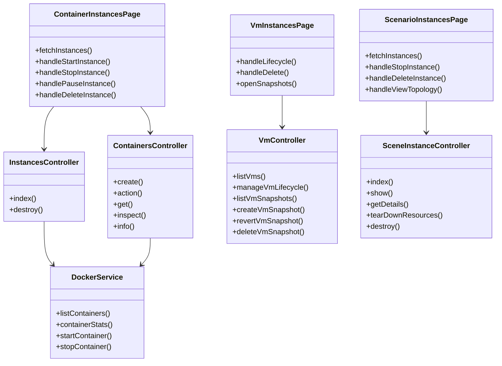
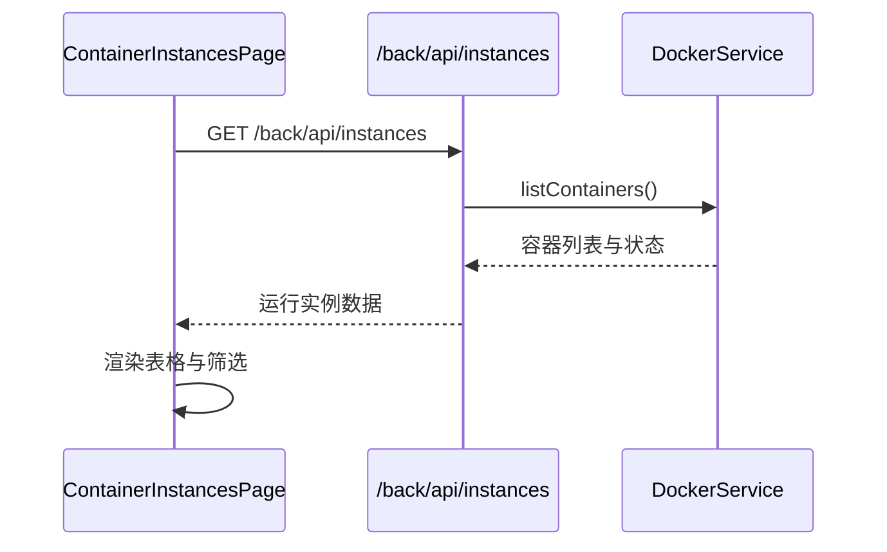
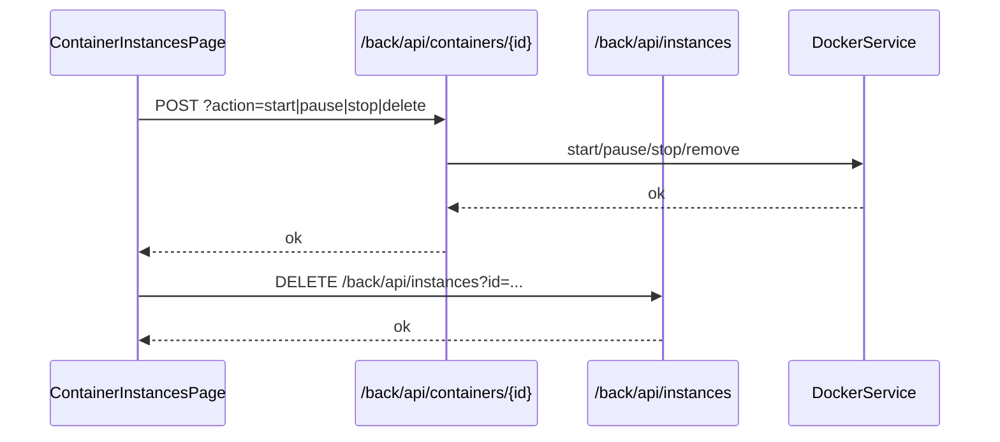
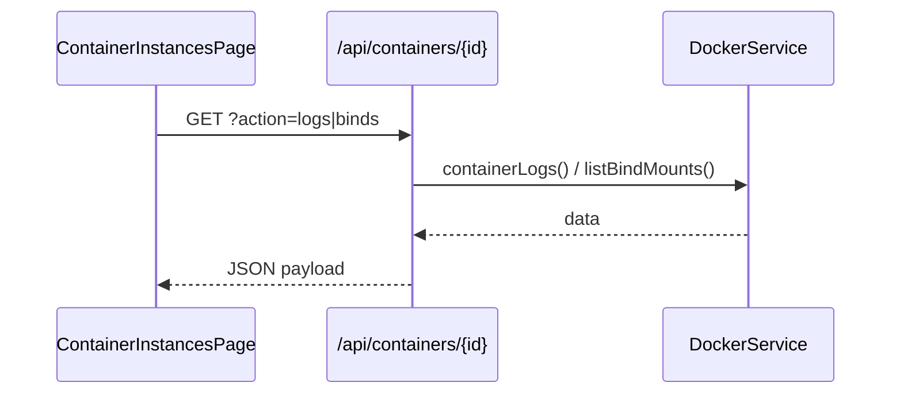
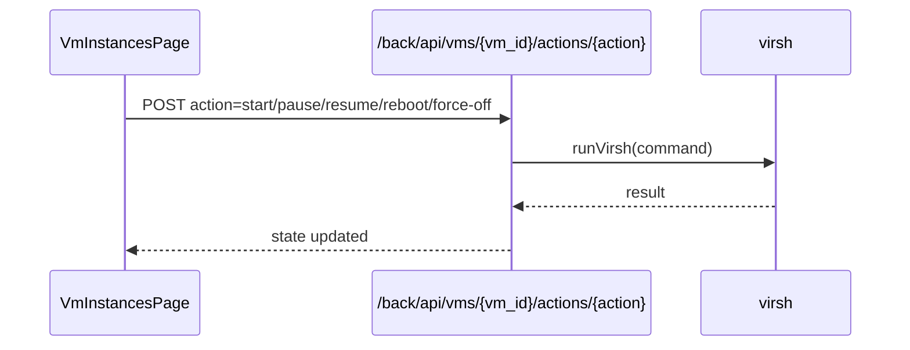
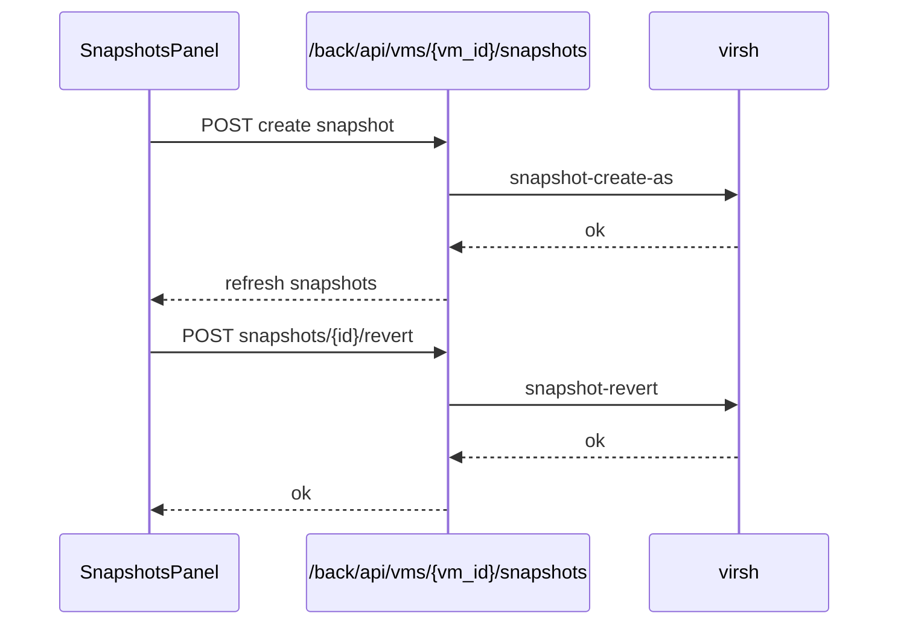
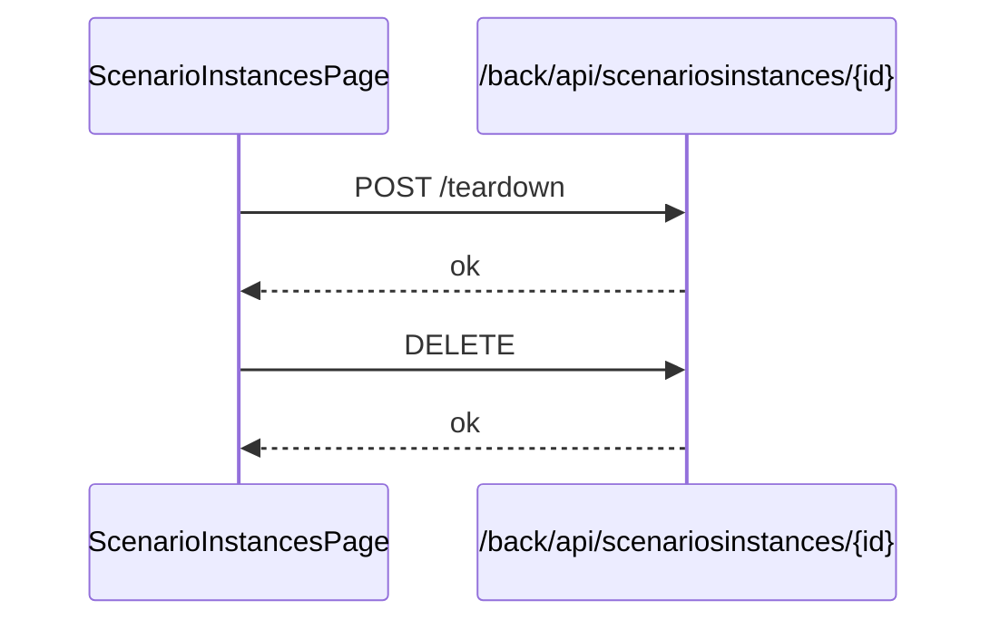

# 软件设计说明书（实例管理模块）

## 1. 模块概述与范围

实例管理模块覆盖容器实例、虚拟机实例与场景实例的全生命周期管理，包括实例列表展示、检索筛选、状态与资源信息展示、启动/暂停/停止/删除等生命周期操作，以及场景实例级别的资源拓扑与细节查看。该模块以“实例”为核心对象，将运行态资源与场景配置、容器/虚拟机的状态关联展示，使管理员与教学场景维护人员可以在统一入口完成实例监控与处置。 

本说明书**不包含**以下内容：

1. 虚拟机的 VNC/Guacamole 连接能力与相关接口。
2. Docker 容器的 Terminal/终端连接能力与权限判断流程。

上述功能虽在代码库中存在，但不在本模块当前文档的范围内。 

## 2. 代码范围与文件清单

### 2.1 前端页面与组件

- 容器实例管理页面：`src/app/scenario/instances/page.tsx`
- 虚拟机实例管理页面：`src/app/scenario/vm-instances/page.tsx`
- 场景实例管理页面：`src/app/scenario/sceneinstances/page.tsx`
- 场景实例容器/虚拟机/交换机标签页：
  - `src/app/scenario/sceneinstances/ContainerInstancesTab.tsx`
  - `src/app/scenario/sceneinstances/VmInstancesTab.tsx`
  - `src/app/scenario/sceneinstances/SwitchInstancesTab.tsx`
- 实例详情与辅助视图：
  - `src/components/scenario/InstanceDetailsModal.tsx`
  - `src/components/scenario/ContainerLogsModal.tsx`
  - `src/components/scenario/ContainerInspectModal.tsx`
  - `src/components/scenario/BindMountsModal.tsx`
  - `src/app/scenario/sceneinstances/InstanceDetailsDialog.tsx`
  - `src/app/scenario/sceneinstances/InstanceTopologyDialog.tsx`
  - `src/app/scenario/sceneinstances/IptablesDialog.tsx`
- 虚拟机快照管理面板：`src/components/vm/SnapshotsPanel.tsx`
- 创建实例对话框：
  - `src/components/scenario/CreateContainerModal.tsx`
  - `src/components/vm/CreateVmModal.tsx`

### 2.2 Next.js API（前端侧后端）

- 容器实例列表/增删改：`src/app/api/instances/route.ts`
- 容器实例创建：`src/app/api/containers/route.ts`
- 容器实例动作/详情：`src/app/api/containers/[id]/route.ts`

### 2.3 业务服务与数据层

- Docker 实例信息读取/控制：`src/lib/docker.ts`
- Prisma 实例数据访问：`src/lib/db/queries.ts`
- Prisma 数据模型：`src/prisma/schema.prisma`
- 运行实例类型定义：`src/types.ts`
- 状态展示翻译：`src/constants.ts`

### 2.4 Laravel 后端（/back/api）

- 容器实例列表：`back/app/Http/Controllers/Docker/InstancesController.php`
- 容器实例操作：`back/app/Http/Controllers/Docker/ContainersController.php`
- 虚拟机实例管理：`back/app/Http/Controllers/Vm/VmController.php`
- 场景实例管理：`back/app/Http/Controllers/scenario/InstanceController.php`
- 容器与虚拟机实例模型：
  - `back/app/Models/scenario/SceneInstance.php`
  - `back/app/Models/scenario/SceneContainerInstance.php`
  - `back/app/Models/scenario/SceneVmInstance.php`
  - `back/app/Models/scenario/SceneSwitchInstance.php`
- API 路由汇总：`back/routes/api.php`

## 3. 功能设计（详细功能点）

### 3.1 容器实例管理

容器实例管理页面提供容器运行态列表展示、关键词搜索、列展示控制与周期性刷新能力，并支持容器生命周期操作（启动、暂停、停止、删除）。在列表中，容器的运行状态、镜像名称、端口映射、资源占用（CPU/内存）与场景关联信息可直接可视化展示，并且通过“更多操作”菜单可以查看容器日志、容器 Inspect 详情与挂载点信息。对于需要快速拉起服务的场景，还提供“创建实例”入口以指定镜像与端口映射创建容器。 

具体功能点：

1. 实例列表展示：显示容器名称、状态、IP、镜像名、端口、CPU/内存、运行时间、场景关联信息。
2. 搜索与筛选：支持按名称、ID、镜像名、IP 搜索；可过滤只显示运行中的容器。
3. 生命周期操作：启动、暂停、停止、删除容器实例。
4. 详情与运维视图：查看日志、Inspect 详情与挂载点信息。
5. 刷新与轮询：手动刷新与定时轮询（5 秒）结合。
6. 创建容器实例：通过创建对话框提交镜像、端口映射等参数。

### 3.2 虚拟机实例管理

虚拟机实例管理页面以虚拟机为对象，展示虚拟机名称、运行状态、主机节点、CPU/内存、IP 与 UUID 等信息，并提供生命周期操作（启动、暂停、重启、强制关机、删除）。此外，页面内置快照管理入口，可对虚拟机进行快照创建、恢复与删除。该页面使用 SWR 进行智能轮询，以在虚拟机状态变化时保持及时刷新。 

具体功能点：

1. 实例列表展示：展示虚拟机名称、状态、主机节点、CPU/内存、IP、UUID。
2. 搜索与筛选：支持按名称搜索；可过滤只显示运行中的虚拟机。
3. 生命周期操作：启动、暂停/恢复、重启、强制关机、删除虚拟机实例。
4. 快照管理：创建快照、恢复快照、删除快照，树形展示快照层级。
5. 智能轮询：根据状态变化调整轮询周期，提高操作反馈及时性。

### 3.3 场景实例管理

场景实例管理页面面向场景级资源集合，提供实例列表、状态与运行时长展示，并支持停止与删除场景实例。页面还可打开实例详情弹窗与拓扑视图，查看场景配置及节点拓扑信息，同时提供 iptables 管理入口以便进行场景内网络规则的运维查看与调整。 

具体功能点：

1. 场景实例列表：展示场景名称、创建用户、运行时长、状态与节点信息。
2. 搜索与排序：支持按场景名称与用户名搜索、按运行时长/状态排序。
3. 实例操作：停止场景实例（拆卸资源）、删除场景实例（清理资源）。
4. 详情与拓扑：查看实例详情与拓扑结构（基于场景配置）。
5. iptables 管理：查看或管理场景实例的网络规则。 

## 4. 数据结构设计

### 4.1 容器实例表（Instance）

**表-字段清单：Instance（Prisma/SQLite）**

| 字段名 | 类型 | 约束 | 说明 |
| --- | --- | --- | --- |
| id | String | 主键 | 容器实例唯一 ID。 |
| name | String | 非空 | 实例名称。 |
| type | String | 非空 | 实例类型（如 container）。 |
| status | String | 非空 | 运行状态。 |
| ip_address | String | 非空 | IP 地址或端口映射信息。 |
| image_name | String | 非空 | 镜像名称。 |
| cpu_usage | String | 非空 | CPU 使用率字符串。 |
| memory_usage | String | 非空 | 内存使用率字符串。 |
| disk_usage | String | 非空 | 磁盘使用信息。 |
| uptime | String | 非空 | 运行时长。 |
| node_id | String | 可空 | 所属节点。 |
| created_at | DateTime | 非空 | 创建时间。 |

### 4.2 场景实例表（c_scene_instances）

**表-字段清单：c_scene_instances（场景实例）**

| 字段名 | 类型 | 约束 | 说明 |
| --- | --- | --- | --- |
| c_scene_instances_id | String | 主键 | 场景实例 ID。 |
| c_config_id | String/Int | 可空 | 场景配置 ID。 |
| c_username | String | 可空 | 创建用户。 |
| c_status | String | 可空 | 场景实例状态。 |
| c_scene_config | JSON | 可空 | 场景配置快照。 |
| c_hostname | String | 可空 | 所属主机名。 |
| c_runtime | DateTime | 自动 | 创建时间（时间戳字段）。 |

### 4.3 场景容器实例表（c_scene_container_instances）

**表-字段清单：c_scene_container_instances**

| 字段名 | 类型 | 约束 | 说明 |
| --- | --- | --- | --- |
| c_container_id | String | 主键 | 容器实例 ID。 |
| c_scene_instances_id | String | 外键 | 关联场景实例 ID。 |
| c_flag | String | 可空 | 靶标标识或标记。 |
| c_ip | String | 可空 | 容器 IP。 |
| c_container_name | String | 可空 | 容器名称。 |
| c_team_id | String | 可空 | 归属队伍 ID。 |

### 4.4 场景虚拟机实例表（c_scene_vm_instances）

**表-字段清单：c_scene_vm_instances**

| 字段名 | 类型 | 约束 | 说明 |
| --- | --- | --- | --- |
| c_vm_id | Int | 主键 | 虚拟机实例记录 ID。 |
| c_vm_name | String | 非空 | 虚拟机名称。 |
| c_scene_instances_id | String | 外键 | 关联场景实例 ID。 |
| c_ip | String | 可空 | 虚拟机 IP。 |
| c_flag | String | 可空 | 靶标标识或标记。 |
| c_team_id | String | 可空 | 归属队伍 ID。 |

### 4.5 场景交换机实例表（c_scene_switch_instances）

**表-字段清单：c_scene_switch_instances**

| 字段名 | 类型 | 约束 | 说明 |
| --- | --- | --- | --- |
| c_switch_name | String | 非空 | 交换机名称。 |
| c_scene_instances_id | String | 外键 | 关联场景实例 ID。 |

### 4.6 运行实例前端结构（RunningInstance）

**表-字段清单：RunningInstance（前端类型）**

| 字段名 | 类型 | 约束 | 说明 |
| --- | --- | --- | --- |
| id | String | 非空 | 实例唯一 ID。 |
| name | String | 非空 | 实例名称。 |
| type | String | 非空 | 实例类型（container/vm/交换机等）。 |
| status | String | 非空 | 运行状态。 |
| ipAddress | String | 可空 | IP 地址。 |
| scene_instance_id | String | 可空 | 关联场景实例 ID。 |
| scene_name | String | 可空 | 关联场景名称。 |
| ports | String | 可空 | 端口映射信息。 |
| imageName | String | 非空 | 镜像名称。 |
| cpuUsage | String | 非空 | CPU 使用率。 |
| memoryUsage | String | 非空 | 内存使用率。 |
| diskUsage | String | 可空 | 磁盘使用情况。 |
| uptime | String | 非空 | 运行时间。 |
| nodeId | String | 可空 | 节点信息。 |
| createdAt | String | 非空 | 创建时间（ISO）。 |

## 5. 类设计与结构关系

### 5.1 类图（Mermaid）

### 5.2 结构说明

实例管理模块的核心页面分为容器实例、虚拟机实例与场景实例三类入口。容器实例通过 DockerService 获取运行态容器与资源占用信息，同时配合场景实例数据库表补充 IP、场景名称等信息；虚拟机实例通过 VmController 封装 virsh 调用，提供生命周期与快照管理；场景实例管理通过 InstanceController 统一查询、停止与删除场景实例，并在前端提供拓扑与详情查看。前端通过 `customFetch` 统一携带认证信息，并使用表格组件完成多维度筛选与分页展示。 

## 6. 关键流程设计（典型业务场景）

### 6.1 典型场景一：容器实例列表加载与刷新

**流程说明**：进入容器实例页面后，前端调用 `/back/api/instances` 拉取容器实例列表。后端从 Docker 容器列表中构建结果，并通过关联场景实例表补充场景信息和 IP。前端每 5 秒轮询一次，同时支持手动刷新。 

### 6.2 典型场景二：容器实例生命周期操作

**流程说明**：用户在容器实例表格中选择启动/暂停/停止/删除操作后，前端弹出确认框，确认后调用 `/back/api/containers/{id}?action=...` 执行动作；删除时还会调用 `/back/api/instances?id=...` 清理本地实例记录。 

### 6.3 典型场景三：容器实例日志/详情/挂载点查看

**流程说明**：通过“更多操作”菜单触发日志与挂载点查看时，前端调用 `/api/containers/{id}?action=logs` 与 `/api/containers/{id}?action=binds`；Inspect 详情则通过 `/back/api/containers/{id}/inspect` 获取。后端透传 Docker Inspect/Stats 结果并返回 JSON，前端在弹窗中展示。 

### 6.4 典型场景四：虚拟机实例生命周期管理

**流程说明**：虚拟机实例页面通过 `/back/api/vms` 拉取列表，在操作时调用 `/back/api/vms/{vm_id}/actions/{action}` 执行状态切换。后端使用 virsh 执行命令并等待状态完成后返回。 

### 6.5 典型场景五：虚拟机快照管理

**流程说明**：用户在快照面板创建、恢复或删除快照时，前端分别调用 `/back/api/vms/{vm_id}/snapshots`、`/back/api/vms/{vm_id}/snapshots/{id}/revert` 与 `/back/api/vms/{vm_id}/snapshots/{id}`，后端调用 virsh snapshot 系列命令并返回结果。 

### 6.6 典型场景六：场景实例停止与删除

**流程说明**：场景实例页面支持停止与删除操作。停止操作调用 `/back/api/scenariosinstances/{id}/teardown`，后端拆卸场景资源；删除操作调用 `/back/api/scenariosinstances/{id}` 清理实例记录。 

## 7. 接口实现要点

**接口清单（实例管理模块）**

| 路径 | 方法 | 功能 | 备注 |
| --- | --- | --- | --- |
| `/back/api/instances` | GET | 获取容器实例列表 | Docker 列表 + 场景信息聚合。 |
| `/back/api/instances` | DELETE | 删除实例记录 | 删除本地实例记录。 |
| `/api/instances` | GET | 获取容器实例列表 | Next.js 接口（基于 dockerode）。 |
| `/api/instances` | POST | 新建实例记录 | 写入实例数据表。 |
| `/api/instances` | PUT | 更新实例记录 | 更新实例数据表。 |
| `/api/instances` | DELETE | 删除实例记录 | 删除实例数据表记录。 |
| `/back/api/containers` | POST | 创建容器实例 | 创建并启动容器。 |
| `/back/api/containers/{id}` | POST | 容器生命周期操作 | start/stop/pause/unpause/delete。 |
| `/api/containers` | POST | 创建容器实例 | Next.js 接口，创建并记录实例。 |
| `/api/containers/{id}` | GET | 容器日志/挂载点 | 通过 action=logs/binds 查询。 |
| `/api/containers/{id}` | POST | 容器生命周期操作 | start/stop/pause/unpause/delete。 |
| `/back/api/containers/{id}/inspect` | GET | 容器 Inspect | 返回 Docker Inspect。 |
| `/back/api/containers/{id}/info` | GET | 容器信息 | 聚合状态与资源占用。 |
| `/back/api/vms` | GET | 获取虚拟机实例列表 | virsh list + DB 补充。 |
| `/back/api/vms/{vm_id}` | GET | 获取虚拟机详情 | 运行态与资源信息。 |
| `/back/api/vms/{vm_id}` | DELETE | 删除虚拟机 | 删除实例及存储。 |
| `/back/api/vms/{vm_id}/actions/{action}` | POST | 虚拟机生命周期操作 | start/pause/resume/reboot/force-off。 |
| `/back/api/vms/{vm_id}/snapshots` | GET | 获取快照列表 | 返回快照树结构数据。 |
| `/back/api/vms/{vm_id}/snapshots` | POST | 创建快照 | 创建并返回快照信息。 |
| `/back/api/vms/{vm_id}/snapshots/{snapshot_id}/revert` | POST | 恢复快照 | 虚拟机状态回滚。 |
| `/back/api/vms/{vm_id}/snapshots/{snapshot_id}` | DELETE | 删除快照 | 删除指定快照。 |
| `/back/api/scenariosinstances` | GET | 获取场景实例列表 | 供场景实例管理页面使用。 |
| `/back/api/scenariosinstances/{id}` | GET | 获取场景实例详情 | 支持详情弹窗。 |
| `/back/api/scenariosinstances/{id}` | DELETE | 删除场景实例 | 清理实例与关联资源。 |
| `/back/api/scenariosinstances/{id}/details` | GET | 获取场景实例详情信息 | 展示拓扑/节点细节。 |
| `/back/api/scenariosinstances/{id}/teardown` | POST | 停止场景实例 | 拆卸场景资源。 |
| `/back/api/scenariosinstances/iptables` | GET | 获取 iptables 信息 | 场景实例网络规则查看。 |
| `/back/api/scenariosinstances/iptables` | DELETE | 删除 iptables 规则 | 场景实例网络规则维护。 |

## 8. 设计要点与边界说明

1. **多源数据聚合**：容器实例信息来自 Docker 运行态，虚拟机实例来自 virsh，场景实例来自业务数据库，三类实例统一在前端以表格方式展示。
2. **状态驱动操作**：容器与虚拟机操作均以状态为判定条件，避免重复操作造成状态异常。
3. **高频刷新与一致性**：容器实例使用固定轮询，虚拟机实例使用智能轮询，保证资源状态与操作反馈及时。
4. **快照为扩展能力**：虚拟机快照管理作为实例管理的扩展能力，但不涉及 VNC/终端链接。
5. **范围限制**：VNC/Guacamole 与容器终端访问不在本文范围内；相关接口未在接口清单中描述。
