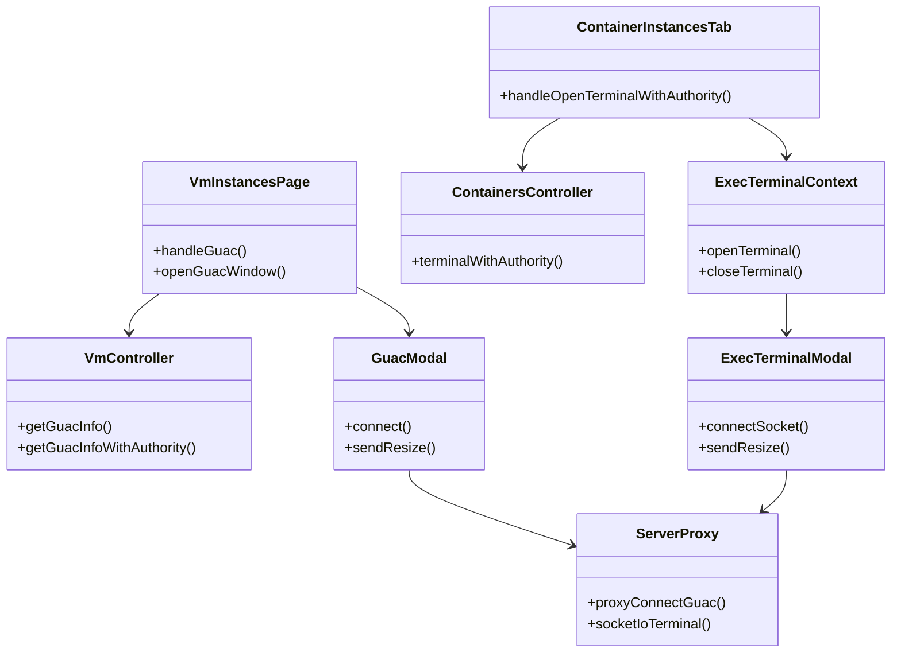
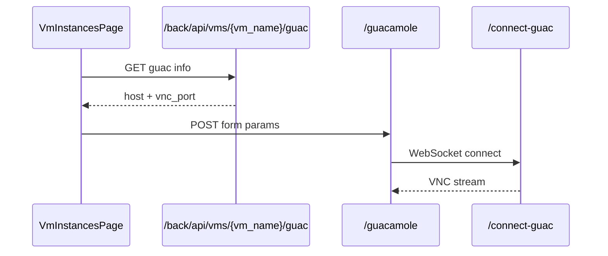
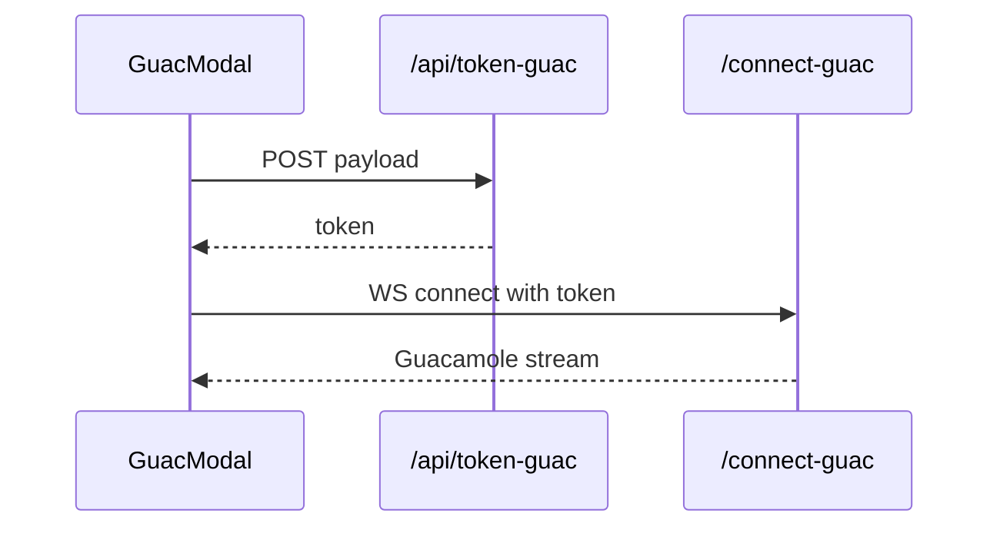
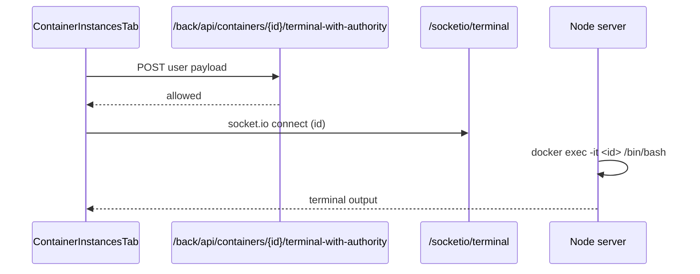

# 软件设计说明书（远程访问代理集成模块）

## 1. 模块概述与范围

远程访问代理集成模块负责将平台内的“虚拟机 VNC 访问”与“容器终端访问”统一接入到 Web UI。该模块通过 Guacamole Lite 服务与 WebSocket 代理实现虚拟机远程桌面/控制台连接，并通过 Socket.IO + pty 为容器提供交互式终端。前端侧负责发起连接、弹窗渲染与输入输出交互，后端侧负责权限校验与连接参数的生成与代理转发。 

本文档覆盖的能力范围包括：

- 虚拟机 VNC 链接路径（Guacamole 代理与连接参数获取）。
- 容器 Terminal 的打开与权限校验流程。
- WebSocket/代理端点与关键的安全边界。 

不包含内容：

- 实例管理模块中的其它生命周期操作（启动、停止等）。
- 镜像管理与场景管理相关流程。

## 2. 代码范围与文件清单

### 2.1 前端页面与组件

- 虚拟机实例页面中的 VNC 入口：`src/app/scenario/vm-instances/page.tsx`
- 场景实例的 VM/VNC 入口：`src/app/scenario/sceneinstances/VmInstancesTab.tsx`
- 学习场景 VM/VNC 入口：`src/components/learning/sceneinstances/VmInstancesTab.tsx`
- 远程终端上下文：`src/contexts/ExecTerminalContext.tsx`
- 终端弹窗组件：`src/components/scenario/ExecTerminalModal.tsx`
- Guacamole 弹窗组件：`src/components/vm/GuacModal.tsx`
- Guacamole 页面封装：`src/app/guacamole/route.ts`

### 2.2 Next.js API

- Guacamole Token 生成：`src/app/api/token-guac/route.ts`

### 2.3 Node 服务与代理

- 统一服务入口与代理：`src/server.js`
- Guacamole 静态入口 HTML：`src/public/index.html`

### 2.4 Laravel 后端（/back/api）

- VM 连接信息：`back/app/Http/Controllers/Vm/VmController.php`
- 容器终端权限接口：`back/app/Http/Controllers/Docker/ContainersController.php`
- API 路由：`back/routes/api.php`

## 3. 功能设计（详细功能点）

### 3.1 虚拟机 VNC 远程访问

虚拟机 VNC 访问功能在前端通过“VNC 控制台”入口触发。用户在虚拟机列表中点击后，页面调用后端 `/back/api/vms/{vm_name}/guac`（或带 authority 的版本）获取连接参数，包括 host 与 vnc 端口等信息，随后通过隐藏表单跳转到 `/guacamole` 路由生成内嵌 iframe 页面。该 iframe 加载 `public/index.html` 并建立 Guacamole WebSocket 通道连接 `/connect-guac`，最终实现 VNC 控制台在浏览器内打开。 

关键功能点：

1. 连接参数获取：通过 `/back/api/vms/{vm_name}/guac` 返回 SSH/RDP/VNC 端口信息（本文仅强调 VNC）。
2. 页面跳转与封装：使用 `/guacamole` route 生成 iframe 页面，确保连接参数安全传递。
3. Guacamole WebSocket 通道：通过 `/connect-guac` 代理连接到内部 Guacamole Lite 服务。
4. Token 化参数传递：通过 `/api/token-guac` 生成加密 token，用于 Guacamole Client 连接。

### 3.2 容器 Terminal 远程访问

容器终端访问由前端触发“打开终端”操作并调用 `/back/api/containers/{id}/terminal-with-authority` 进行权限校验。权限校验通过后，前端通过 ExecTerminalContext 打开终端弹窗，弹窗使用 Socket.IO 连接 `/socketio/terminal`，后端在 Node 侧调用 `docker exec` 启动 pty，并将输入输出通过 Socket.IO 传输，实现浏览器内的交互式终端。 

关键功能点：

1. 权限校验：后端根据 token/角色/队伍关系判断是否允许访问终端。
2. 终端连接：Socket.IO 连接 `/socketio/terminal`，以容器 ID 作为 query。
3. pty 交互：Node 服务启动 `docker exec -it` 并进行输入输出透传。
4. 多终端管理：ExecTerminalContext 支持同时打开多个终端并管理 z-index。 

## 4. 数据结构设计

### 4.1 Guacamole Token Payload

**表-字段清单：Guacamole Token Payload**

| 字段名 | 类型 | 约束 | 说明 |
| --- | --- | --- | --- |
| type | String | 非空 | 连接类型：ssh/rdp/vnc。 |
| hostname | String | 非空 | 远端主机地址。 |
| port | String | 非空 | 连接端口。 |
| username | String | 可空 | SSH/RDP 用户名。 |
| password | String | 可空 | SSH/RDP 密码。 |

说明：该 payload 由 GuacModal 组织并提交到 `/api/token-guac`，后端使用 AES-256-CBC 加密生成 token。 

### 4.2 VM 连接信息响应结构

**表-字段清单：VM Guac Info**

| 字段名 | 类型 | 约束 | 说明 |
| --- | --- | --- | --- |
| host | String | 非空 | VM 可访问地址。 |
| ssh_port | Int | 非空 | SSH 端口。 |
| rdp_port | Int | 非空 | RDP 端口。 |
| vnc_port | Int | 非空 | VNC 端口。 |

说明：VmController 的 `getGuacInfo` 与 `getGuacInfoWithAuthority` 返回此结构。 

### 4.3 容器终端权限校验请求

**表-字段清单：Terminal Authority Request**

| 字段名 | 类型 | 约束 | 说明 |
| --- | --- | --- | --- |
| username | String | 可空 | 当前用户名（前端透传）。 |
| user | Object | 可空 | 支持用户信息（support user）。 |
| roles | String[] | 可空 | 当前用户角色列表。 |

说明：前端在场景实例列表中会合并用户信息与角色信息，并在请求体中传递给权限校验接口。 

## 5. 类设计与结构关系

### 5.1 类图（Mermaid）

### 5.2 结构说明

虚拟机 VNC 流程由前端页面触发调用后端 Guac 信息接口，之后通过 `/guacamole` 页面封装和 Guacamole WebSocket 通道连接完成远程桌面展示；容器终端访问则先调用权限校验接口，通过后再打开 ExecTerminalModal 并连接 `/socketio/terminal`。Node 服务承担 Guacamole 代理与终端 WebSocket 的统一接入，使前端的连接路径统一在同一域名下。 

## 6. 关键流程设计（典型业务场景）

### 6.1 典型场景一：虚拟机 VNC 连接

**流程说明**：用户点击“VNC 控制台”后，前端调用 `/back/api/vms/{vm_name}/guac` 获取连接信息，随后通过 `/guacamole` 页面进行 iframe 包装，iframe 内的 Guacamole 前端脚本建立 WebSocket 连接 `/connect-guac` 并渲染远程桌面。 

### 6.2 典型场景二：Guacamole Token 生成与连接

**流程说明**：GuacModal 使用 `/api/token-guac` 生成加密 token，随后以 `connect-guac?token=...` 建立 WebSocket 连接，避免将明文连接参数直接暴露在前端。 

### 6.3 典型场景三：容器终端权限校验与打开

**流程说明**：用户点击“打开终端”后，前端调用 `/back/api/containers/{id}/terminal-with-authority` 校验权限，成功后打开 ExecTerminalModal，Socket.IO 连接 `/socketio/terminal` 并使用 `docker exec` 建立交互。 

## 7. 接口实现要点

**接口清单（远程访问代理集成模块）**

| 路径 | 方法 | 功能 | 备注 |
| --- | --- | --- | --- |
| `/back/api/vms/{vm_name}/guac` | GET | 获取 VM 远程访问参数 | 返回 host + vnc_port 等。 |
| `/back/api/vms/{vm_name}/guac-with-authority` | GET | 权限校验后获取连接参数 | 场景实例中使用。 |
| `/api/token-guac` | POST | 生成 Guacamole token | AES-256-CBC 加密。 |
| `/guacamole` | GET/POST | Guacamole 页面包装 | 返回 iframe HTML。 |
| `/connect-guac` | WS | Guacamole WebSocket 代理 | 代理到内部 guac 服务。 |
| `/back/api/containers/{id}/terminal-with-authority` | GET/POST | 容器终端权限校验 | 通过后允许打开终端。 |
| `/socketio/terminal` | WS | 容器终端 Socket.IO 入口 | 基于 docker exec。 |

## 8. 设计要点与边界说明

1. **双通道代理**：VNC 通过 Guacamole Lite + `/connect-guac` 代理，终端通过 Socket.IO + `/socketio/terminal` 通道实现。
2. **Token 化访问**：Guacamole 连接参数加密后再传递，避免明文暴露主机与端口。
3. **权限隔离**：容器终端访问前置权限检查，避免非授权用户直接连接终端。
4. **统一入口**：Node 服务统一处理代理与 WebSocket 接入，使前端不需区分内部服务地址。
5. **范围限制**：本文档只描述 VNC 与 Docker Terminal，不覆盖实例管理或其它运维功能。 

