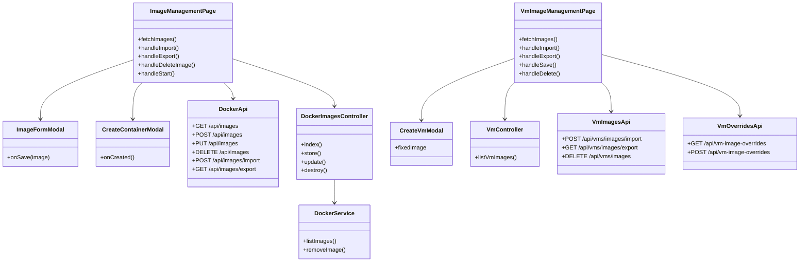
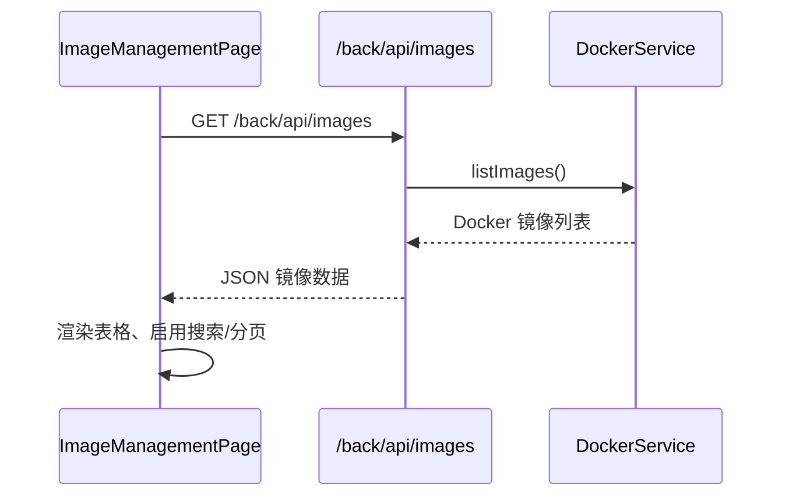
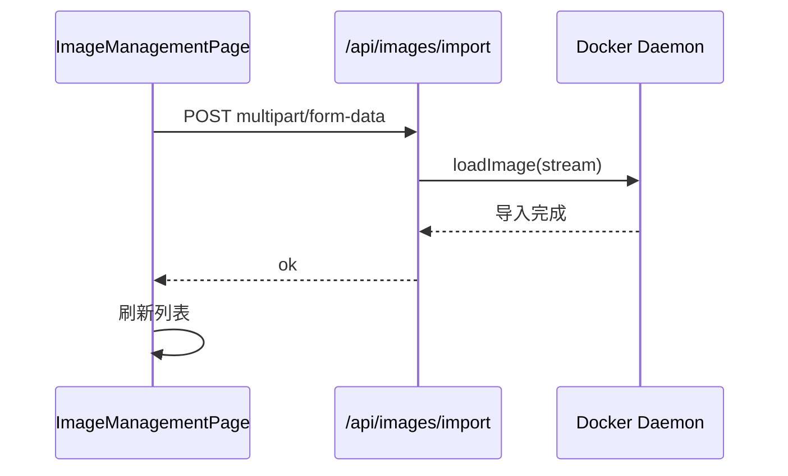
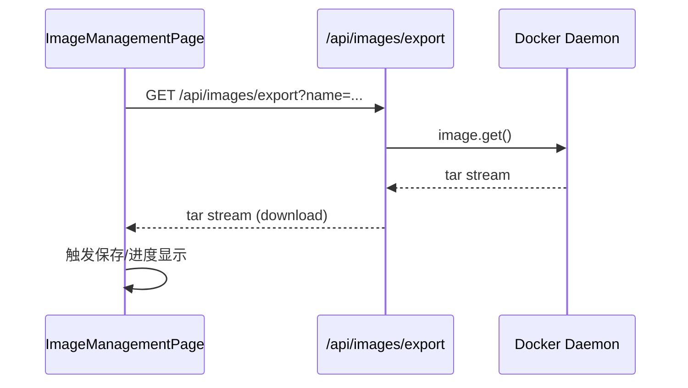
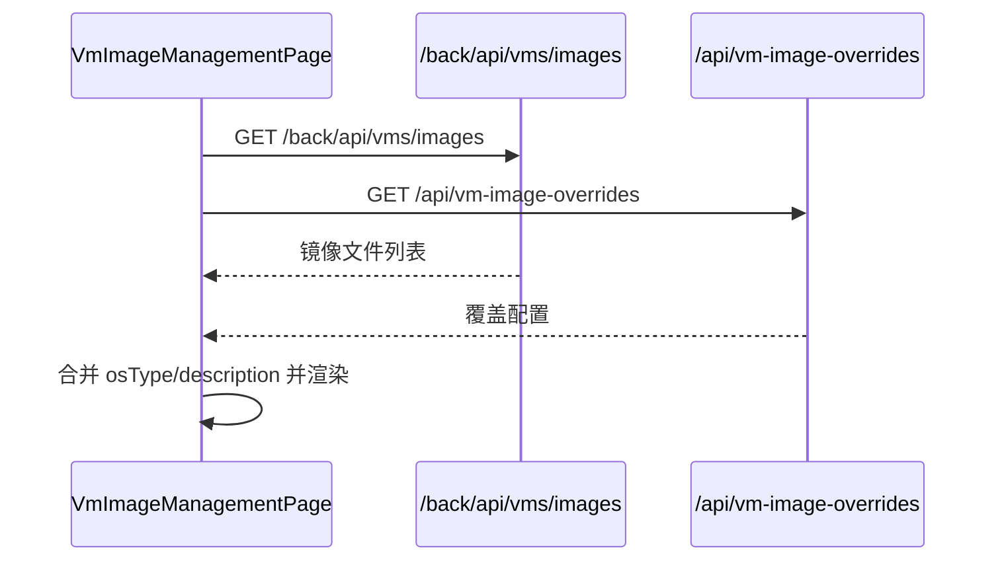
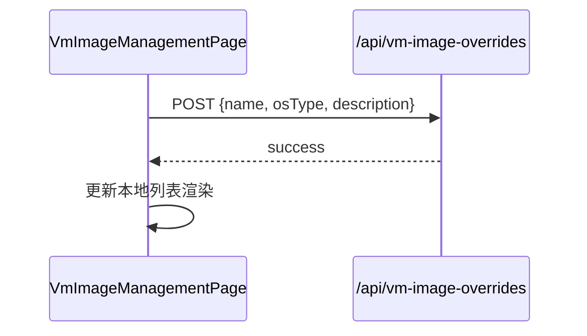
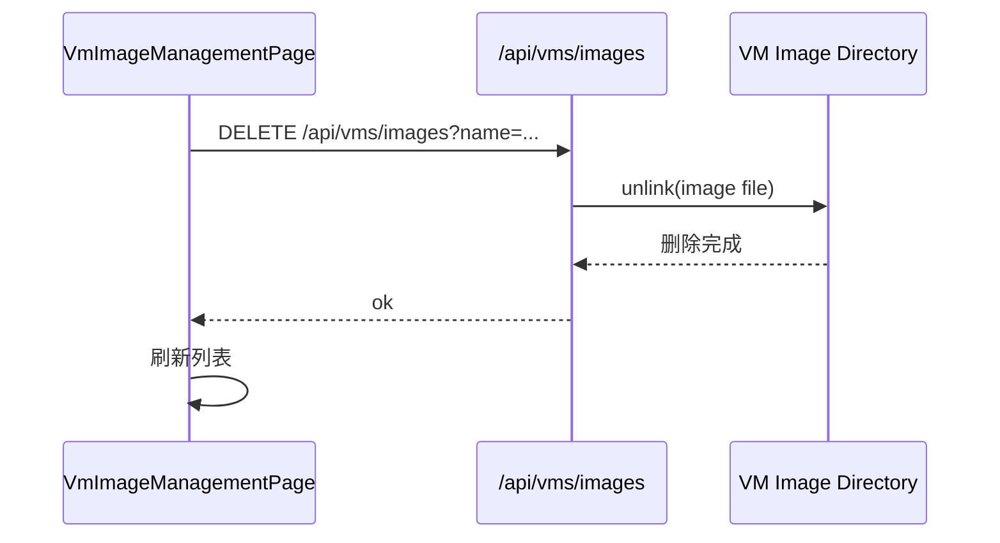

# 软件设计说明书（镜像管理模块）

## 1. 模块概述与范围

镜像管理模块负责对平台内“容器镜像”与“虚拟机镜像”的统一展示、导入导出、元数据维护与删除，并在必要时提供从镜像快速启动容器或虚拟机的入口。整体架构以前端页面为入口，容器镜像通过 Docker 守护进程获取与操作，虚拟机镜像通过 libvirt/virsh 的存储池目录读取并结合本地 JSON 覆盖配置完善描述信息，同时在后端提供 REST API 以满足列表、增删改查与导入导出等操作需求。模块所涵盖的 UI 页面包括“容器镜像管理”与“虚拟机镜像管理”，对应的后端接口既包括 Laravel 的 `/back/api` 代理，也包括 Next.js 自身的 `/api` 辅助能力。前后端协同的主线以“镜像清单”为核心对象，并衍生“镜像文件上传/下载”“镜像元数据编辑”“按镜像创建实例”等场景。该模块的边界明确：不直接承担容器/虚拟机运行态监控，相关运行态信息由其他子模块负责。 

## 2. 代码范围与文件清单

### 2.1 前端页面与组件

- 容器镜像管理页面：`src/app/scenario/images/page.tsx`
- 虚拟机镜像管理页面：`src/app/scenario/vm-images/page.tsx`
- 容器镜像新增/编辑弹窗：`src/components/imagemanagement/ImageFormModal.tsx`
- 容器创建弹窗（从镜像启动）：`src/components/scenario/CreateContainerModal.tsx`
- 虚拟机创建弹窗（从镜像启动）：`src/components/vm/CreateVmModal.tsx`

### 2.2 Next.js API（前端侧后端）

- 容器镜像 CRUD：`src/app/api/images/route.ts`
- 容器镜像导入：`src/app/api/images/import/route.ts`
- 容器镜像导出：`src/app/api/images/export/route.ts`
- 虚拟机镜像导入/导出/删除：`src/app/api/vms/images/*`
- 虚拟机镜像覆盖配置：`src/app/api/vm-image-overrides/route.ts`

### 2.3 业务服务与数据层

- Docker 镜像清单读取：`src/lib/docker.ts`
- Prisma 数据访问：`src/lib/db/queries.ts`
- Prisma 数据模型：`src/prisma/schema.prisma`
- 虚拟机镜像目录定位：`src/lib/virsh.ts`
- 虚拟机镜像覆盖配置数据：`src/data/vmImageOverrides.json`

### 2.4 Laravel 后端（/back/api）

- Docker 镜像控制器：`back/app/Http/Controllers/Docker/ImagesController.php`
- Docker 服务封装：`back/app/Services/DockerService.php`
- Docker 镜像模型：`back/app/Models/Docker/Image.php`
- API 路由：`back/routes/api.php`
- 虚拟机镜像控制器：`back/app/Http/Controllers/Vm/VmController.php`

## 3. 功能设计（详细功能点）

### 3.1 容器镜像管理

容器镜像管理页面用于展示当前可用 Docker 镜像，并提供搜索、列显隐、导入/导出与删除等操作。页面加载后通过 `/back/api/images` 获取镜像列表，并根据关键字对名称、版本与描述进行前端过滤；表格支持分页和列显示切换，便于运维或教学人员在镜像数量较多时快速定位目标镜像。此外，页面可通过导入功能上传镜像 tar 包并由后端调用 Docker 载入；导出功能则将指定镜像打包为 tar 并下载到本地。对于需要快速演示或调试的场景，页面提供“启动”入口，通过创建容器弹窗基于镜像启动实例。删除功能在用户确认后调用删除接口删除镜像记录并尝试清理 Docker 本地镜像缓存。 

具体功能点：

1. 镜像列表查询与展示：支持分页、字段展示控制、全量或按条件搜索。
2. 镜像导入：支持多文件选择，展示上传进度，支持取消上传。
3. 镜像导出：导出镜像 tar 包，展示下载进度，支持取消下载。
4. 镜像删除：二次确认后删除镜像并刷新列表。
5. 镜像启动（容器实例）：从镜像快捷创建容器实例入口，带固定镜像参数。
6. 刷新操作：手动触发重新获取镜像列表。

### 3.2 虚拟机镜像管理

虚拟机镜像管理页面针对 libvirt 存储池中的镜像文件，提供列表展示、导入导出、元数据编辑与删除能力。镜像列表由 `/back/api/vms/images` 获取，后端从默认存储池读取可用镜像文件并返回名称、大小、状态、修改时间等信息。由于 libvirt 镜像自身缺少业务描述字段，页面会同步读取 `/api/vm-image-overrides` 的覆盖配置，将 JSON 中的 OS 类型和描述补充到 UI 展示，并允许在编辑对话框中更新覆盖配置。导入功能会上传镜像文件到存储池目录；导出会读取存储池文件并生成下载流；删除操作直接删除镜像文件。可选“启动”入口支持从镜像创建虚拟机实例（默认隐藏，由常量控制）。 

具体功能点：

1. 镜像列表查询与展示：支持名称/描述/OS 类型搜索与分页展示。
2. 镜像导入：多文件上传至默认存储池目录，显示上传进度，支持取消。
3. 镜像导出：从存储池读取镜像文件并下载，显示下载进度，支持取消。
4. 镜像编辑：编辑 OS 类型与描述信息，并保存到覆盖配置 JSON。
5. 镜像删除：确认后删除存储池内镜像文件并刷新列表。
6. 镜像启动（VM 实例）：从镜像快捷创建 VM（受开关控制）。

### 3.3 统一体验与权限逻辑

镜像管理模块通过统一的表格操作与操作按钮向用户提供一致体验。容器镜像接口支持传入角色与用户 ID 参数以做筛选控制（若调用方提供），虚拟机镜像管理主要依赖存储池访问权限与系统级文件权限。前端在调用接口时统一走 `customFetch` 以附带认证信息，后端通过 Docker 守护进程或系统命令读取实际镜像清单。整体上实现了“镜像清单统一视图 + 导入导出 + 元数据维护 + 实例化入口”的完整闭环。 

## 4. 数据结构设计

### 4.1 容器镜像信息表（Image）

**表-字段清单：Image（Prisma/SQLite）**

| 字段名 | 类型 | 约束 | 说明 |
| --- | --- | --- | --- |
| id | String | 主键 | 镜像记录唯一 ID。 |
| name | String | 非空 | 镜像名称（不含版本）。 |
| type | String | 非空 | 镜像类型，容器镜像通常为 `docker`。 |
| version | String | 非空 | 版本号或 tag。 |
| description | String | 非空 | 镜像描述。 |
| file_name | String | 非空 | 镜像文件名（用于记录上传文件）。 |
| size | String | 非空 | 镜像大小字符串。 |
| upload_date | DateTime | 非空 | 上传时间（ISO 形式保存）。 |

说明：该表由 Next.js 的 Prisma 数据访问层维护，用于镜像元数据的持久化与前端展示。Docker 实际镜像信息由 Docker Daemon 返回，在部分场景下用于生成展示数据或与 DB 数据合并。 

### 4.2 虚拟机镜像覆盖配置（vmImageOverrides.json）

**表-字段清单：vmImageOverrides（JSON 映射）**

| 字段名 | 类型 | 约束 | 说明 |
| --- | --- | --- | --- |
| name (Key) | String | 主键（键名） | 镜像文件名，作为映射 key。 |
| osType | String | 可空 | 操作系统类型（如 ubuntu/win10）。 |
| description | String | 可空 | 镜像描述信息。 |

说明：该配置文件作为虚拟机镜像的“业务元数据补充”，与 libvirt 镜像文件本身解耦，便于用户在不改动镜像文件的情况下维护描述信息。 

### 4.3 虚拟机镜像列表结构（后端返回）

**表-字段清单：VmImage（接口响应结构）**

| 字段名 | 类型 | 约束 | 说明 |
| --- | --- | --- | --- |
| id | String | 非空 | 镜像唯一标识，通常等于文件名。 |
| name | String | 非空 | 镜像文件名。 |
| pool | String | 可空 | 存储池名称（默认 default）。 |
| size | String | 可空 | 镜像大小（以 MB 或 M 表示）。 |
| path | String | 可空 | 镜像文件完整路径。 |
| modifiedDate | String | 可空 | 修改时间（ISO 字符串）。 |
| status | String | 可空 | 状态字段（如 available）。 |
| osType | String | 可空 | 覆盖配置中的 OS 类型。 |
| description | String | 可空 | 覆盖配置中的描述。 |

说明：该结构由 `listVmImages` 返回，再由前端与覆盖配置合并后展示。 

### 4.4 容器镜像展示结构（前端 ManagedImage）

**表-字段清单：ManagedImage（前端类型）**

| 字段名 | 类型 | 约束 | 说明 |
| --- | --- | --- | --- |
| id | String | 非空 | 镜像唯一 ID（Docker ID 或 DB ID）。 |
| name | String | 非空 | 镜像名称。 |
| type | 'docker' \| 'vm' | 非空 | 镜像类型。 |
| version | String | 非空 | 镜像版本。 |
| description | String | 非空 | 描述信息。 |
| fileName | String | 可空 | 镜像文件名。 |
| size | String | 可空 | 镜像大小（格式化字符串）。 |
| uploadDate | String | 非空 | 上传时间（ISO 字符串）。 |

说明：该结构用于容器镜像管理页面与相关下游（如创建容器）传参。 

## 5. 类设计与结构关系

### 5.1 类图（Mermaid）

### 5.2 结构说明

镜像管理模块在前端层以两个页面组件为主入口。容器镜像管理依赖于 Laravel `/back/api/images` 读取 Docker 列表并进行 CRUD，同时通过 Next.js API 提供导入/导出能力；虚拟机镜像管理依赖 `/back/api/vms/images` 获取存储池镜像清单，再通过 `/api/vm-image-overrides` 完成 OS/描述的补充与编辑，并使用 `/api/vms/images/import|export|delete` 完成文件级导入导出与删除。DockerService 与 VmController 分别封装 Docker 与 virsh 访问细节，使控制器保持轻量；前端则通过 `customFetch` 统一完成鉴权与异常处理。 

## 6. 关键流程设计（典型业务场景）

### 6.1 典型场景一：容器镜像列表加载

**流程说明**：用户进入容器镜像管理页面后，页面调用 `/back/api/images` 拉取 Docker 镜像列表。后端通过 DockerService 获取镜像清单，并根据角色与用户 ID（若提供）筛选结果，最终返回给前端。前端将数据写入状态并渲染表格，同时支持搜索与列显示切换。 

### 6.2 典型场景二：容器镜像导入

**流程说明**：用户点击“导入”后选择镜像 tar 文件，前端使用 `axios` 以 `multipart/form-data` 上传到 `/api/images/import`。Next.js API 使用 Busboy 解析流并调用 Docker `loadImage` 导入镜像；导入成功后刷新列表。该流程以内存流式处理为主，避免在前端先落地文件。 

### 6.3 典型场景三：容器镜像导出

**流程说明**：用户在列表中点击“导出”，前端请求 `/api/images/export?name=镜像:版本`。后端通过 Docker API 获取镜像 tar 流并以附件方式返回，浏览器触发下载。前端展示下载进度，可选择中止下载。 

### 6.4 典型场景四：虚拟机镜像列表与覆盖信息合并

**流程说明**：虚拟机镜像管理页面进入时并行拉取 `/back/api/vms/images` 与 `/api/vm-image-overrides`。后者是 JSON 映射，用来补充镜像的 OS 类型与描述；前端合并并渲染表格。此方式使镜像文件与描述信息解耦，便于管理。 

### 6.5 典型场景五：虚拟机镜像元数据编辑

**流程说明**：用户点击“编辑”打开对话框并选择 OS 类型或自定义描述。保存时向 `/api/vm-image-overrides` POST 数据，后端读取 JSON 并更新对应条目，随后前端更新内存中的镜像列表，确保界面即时刷新。 

### 6.6 典型场景六：虚拟机镜像删除

**流程说明**：用户确认删除后，前端调用 `/api/vms/images?name=...` 触发删除。后端定位存储池目录并删除镜像文件，随后前端刷新镜像列表。该流程为文件级删除，不涉及 libvirt 运行态实例。 

## 7. 接口实现要点

**接口清单（镜像管理模块）**

| 路径 | 方法 | 功能 | 备注 |
| --- | --- | --- | --- |
| `/back/api/images` | GET | 获取容器镜像列表 | 可携带 role/userId 过滤。 |
| `/back/api/images` | POST | 新增镜像元数据 | 写入镜像元数据表。 |
| `/back/api/images` | PUT | 更新镜像元数据 | 更新镜像元数据表。 |
| `/back/api/images` | DELETE | 删除镜像 | 先尝试删除 Docker 镜像，再删除 DB 记录。 |
| `/api/images/import` | POST | 导入容器镜像 | 上传 tar 并调用 Docker `loadImage`。 |
| `/api/images/export` | GET | 导出容器镜像 | 生成 tar 流响应，支持 Content-Length。 |
| `/back/api/vms/images` | GET | 获取虚拟机镜像列表 | 读取 virsh 存储池目录。 |
| `/api/vms/images/import` | POST | 导入虚拟机镜像 | 上传文件到存储池目录。 |
| `/api/vms/images/export` | GET | 导出虚拟机镜像 | 读取存储池文件并下载。 |
| `/api/vms/images` | DELETE | 删除虚拟机镜像 | 删除存储池镜像文件。 |
| `/api/vm-image-overrides` | GET | 获取虚拟机镜像覆盖配置 | 读取 JSON 映射。 |
| `/api/vm-image-overrides` | POST | 保存虚拟机镜像覆盖配置 | 更新 JSON 映射项。 |

## 8. 设计要点与边界说明

1. **数据源分层**：容器镜像信息来自 Docker Daemon，虚拟机镜像信息来自 libvirt 存储池文件系统，覆盖配置来自 JSON 文件。三类数据源职责清晰，减少数据库对镜像文件的强依赖。
2. **导入导出流式处理**：使用 Busboy 与 ReadableStream 流式处理，降低大文件传输的内存消耗，并提供上传/下载进度反馈。
3. **元数据解耦**：虚拟机镜像业务描述不写入镜像文件本体，而是通过 JSON 覆盖文件维护，便于用户随时调整。
4. **权限与安全**：容器镜像列表接口支持角色过滤；虚拟机镜像操作依赖系统权限与存储池读写权限，需在部署时确保适当的运行权限。
5. **模块边界**：镜像管理模块负责镜像“生命周期与元数据管理”，不直接处理容器/虚拟机运行态的监控与高阶调度，这些由其他子系统完成。

